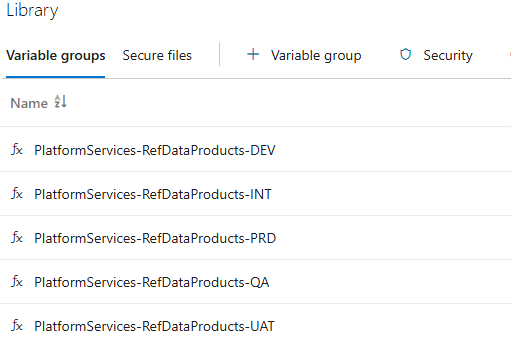
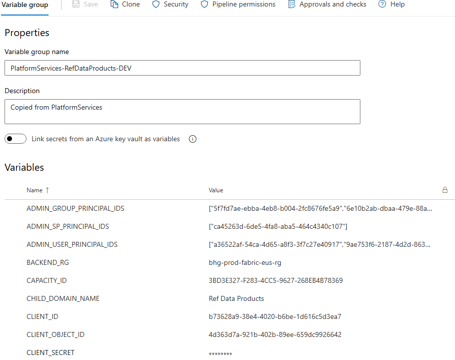
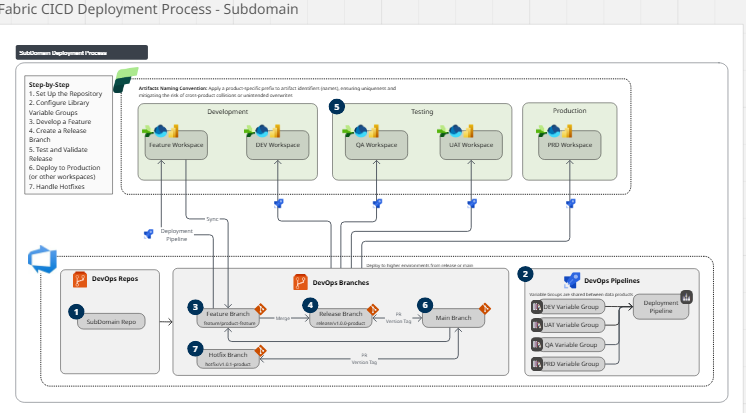

# Gitflow-Inspired Workflow for Multiple Data Products with Azure DevOps CI/CD Integration

This document outlines a **Gitflow-inspired workflow** for managing a Git repository in **Azure DevOps** to develop and release **multiple data products** independently, without a `develop` branch. It provides step-by-step instructions for integrating with a **CI/CD pipeline** using `.yaml` files in the `DevOpsServices` folder and **Library variable groups** per **Microsoft Fabric workspace**. The workflow ensures no interdependencies between data products by using isolated feature and release branches, with rollback capabilities via version tags.

## Table of Contents
1. [Overview of the Workflow](#overview-of-the-workflow)
2. [Branch Types](#branch-types)
3. [Workflow Description](#workflow-description)
4. [Managing Multiple Data Products](#managing-multiple-data-products)
5. [Azure DevOps Setup](#azure-devops-setup)
6. [CI/CD Integration with Azure Pipelines](#cicd-integration-with-azure-pipelines)
7. [Step-by-Step Instructions](#step-by-step-instructions)
8. [Example Azure Pipelines YAML](#example-azure-pipelines-yaml)
9. [Best Practices](#best-practices)
10. [Troubleshooting](#troubleshooting)

---

## Overview of the Workflow

This Gitflow-inspired workflow is designed for developing and releasing **multiple data products** (e.g., notebooks, pipelines, or analytics models) in a single repository without creating interdependencies. It eliminates the `develop` branch, using `main` as the primary branch for production-ready code and feature integration. Short-lived `feature/*`, `release/*`, and `hotfix/*` branches are used for development, release preparation, and urgent fixes, respectively. Rollbacks are supported using version tags. The workflow is integrated with Azure DevOps and Microsoft Fabric for CI/CD and workspace management.

### Key Features
- **Independent Data Products**: Each data product is developed and released in isolated branches to avoid interdependencies.
- **Simplified Branching**: Uses `main` as the single long-lived branch, with temporary feature, release, and hotfix branches.
- **Role-Based Responsibilities**:
  - **Data Engineer**: Manages feature branch creation, development, and pull requests (PRs) for merging into release branches or `main`.
  - **Data Product Architect**: Manages release branch creation, feature integration, testing, and deployment preparation, ensuring release readiness.
- **Stable Production Code**: The `main` branch reflects production-ready code for all data products.
- **CI/CD Integration**: Automates building, and deployment using Azure DevOps Pipelines.
- **Rollback Capability**: Supports reverting to a previous release using version tags.

---

## Branch Types

1. **`main`**
   - Represents the production-ready codebase.
   - Contains only stable, deployed code with version tags (e.g., `v1.0.0-productA`, `v1.0.0-productB`).
   - Serves as the base for feature, release, and hotfix branches.

2. **Feature Branches**
   - Short-lived branches for new features (e.g., `feature/productA-datasets-ingestion-config`, `feature/productB-trigger-ingestion-notebook`).
   - Branched from `main`, managed by **Data Engineers**, and merged into `release/*` branches or directly to `main` via PRs.

3. **Release Branches**
   - Created from `main` by **Data Product Architects** for preparing a production release for a specific data product (e.g., `release/v1.1.0-productA`).
   - Used for final tweaks, bug fixes, and testing.
   - Merged into `main` after deployment, then deleted.

4. **Hotfix Branches**
   - Created from `main` to fix critical production issues for a specific data product (e.g., `hotfix/v1.1.1-productA`).
   - Typically managed by **Data Engineers** or **Data Product Architects**, depending on urgency and team structure.
   - Merged into `main`, then deleted.

5. **Rollback Branches**
   - Created from a previous version tag by **Data Product Architects** to revert a data product to an earlier release (e.g., `rollback/v1.0.0-productA`).
   - Merged into `main` and deployed, then deleted.

---

## Workflow Description

The workflow supports independent development and release of multiple data products:

1. **Feature Development**:
   - Create feature branches from `main` for a specific data product.
   - Merge into a release branch for that product or directly to `main` after testing and review.

2. **Release Preparation**:
   - Create a release branch from `main` for a specific data product (e.g., `release/v1.1.0-productA`).
   - Merge relevant features, apply bug fixes, and test thoroughly.

3. **Production Deployment**:
   - Merge the release branch into `main` and tag it with a product-specific version (e.g., `v1.1.0-productA`).
   - Deploy the data product to production from `main`.
   - Delete the release branch.

4. **Hotfixes**:
   - Create a hotfix branch from `main` for urgent fixes to a specific data product.
   - Merge back to `main` (with a new tag, e.g., `v1.1.1-productA`) and delete.

5. **Rollback**:
   - Revert a data product to a previous release by creating a rollback branch from a tagged version (e.g., `v1.0.0-productA`) and redeploying.

### Diagram
    main:        o----o (v1.0.0-productA) -------------------o (v1.1.0-productA)
                  \                                        /
    feature:       \                                      f1 (productA-datasets-ingestion-config)
    release:        \                                    /
                    o----o----o (release/v1.1.0-productA)
    hotfix:                    h1 (hotfix/v1.1.1-productA) ----o (v1.1.1-productA)
    rollback:                       r1 (rollback/v1.0.0-productA) ----o (v1.0.0-productA-rollback)

*Note*: Each data product (e.g., `productA`, `productB`) follows a similar branch structure in the same repository, with distinct naming conventions to avoid conflicts.

---

## Managing Multiple Data Products

To ensure **no interdependencies** between data products:

- **Isolated Branch Naming**: Use prefixes or suffixes in branch names (e.g., `feature/productA-*`, `release/v1.1.0-productB`) to clearly associate branches with specific data products.
- **Independent Release Cycles**: Each data product has its own release branches and version tags (e.g., `v1.1.0-productA`, `v1.2.0-productB`), allowing independent release schedules.
- **Artifacts Naming Convention**: Apply a product-specific prefix to artifact identifiers (names), ensuring uniqueness and mitigating the risk of cross-product collisions or unintended overwrites.
- **Pipeline Isolation**: Use one CI/CD pipeline for all data products and environments.
- **Workspace-Specific Variables**: Use one Library variable group per environment (e.g., `PlatformServices-DEV`, `PlatformServices-PRD`).

---

## Azure DevOps Setup

Azure DevOps is used for repository management and CI/CD orchestration. Key components include:

- **Repositories**: Host Git repositories with `main`, and other branches.
- **Pipelines**: Defined in `.yaml` files to automate testing, building, and deployment.
- **Library Variable Groups**: Store environment-specific variables (e.g., connection strings, API keys) per **Microsoft Fabric workspace** (e.g., `PlatformServices-DEV`, `PlatformServices-PRD`).

### Prerequisites
- An Azure DevOps project with a Git repository.
- A Microsoft Fabric workspace for development and production environments at the minimum.
- Library variable groups set up in Azure DevOps (e.g., `PlatformServices-DEV`, `PlatformServices-PRD`) with variables like `ADMIN_GROUP_PRINCIPAL_IDS` or `ENVIRONMENT`.

---

## CI/CD Integration with Azure Pipelines

Azure Pipelines automates the Gitflow process using `.yaml` file stored in the repository. The pipeline:
- **CI**: NOT IMPLEMENTED.
- **CD**: Deploys `main` to production after release or hotfix merges.
- **Variable Groups**: Uses Library variable groups to manage environment-specific settings for Fabric workspaces.

### Pipeline Goals
- Validate code quality and functionality before merging - NOT IMPLEMENTED.
- Automate deployment to Microsoft Fabric workspaces.
- Ensure secure access to resources using variable groups.

---

## Step-by-Step Instructions

### 1. **Set Up the Repository**
   - Initialize a Git repository in Azure DevOps:
     ```bash
     git clone <azure-devops-repo-url>
     cd <repo-name>
     git commit -m "Initial commit"
     git push origin main
     ```
   - Protect `main` branch in Azure DevOps:
     - Go to **Repos > Branches**, select `main` and enable **Branch Policies** (e.g., require PRs, minimum reviewers).

### 2. **Configure Library Variable Groups**
   - In Azure DevOps, go to **Pipelines > Library**.
   - Create variable groups with variables for each Fabric workspace:
   ```
   ```

   ```
   ```


   - Link variable groups to pipelines with appropriate permissions.

### 3. **Develop a Feature**
   - Create a feature branch from `main`:
     ```bash
     git checkout main
     git branch feature/productA-datasets-ingestion-config
     git checkout feature/productA-datasets-ingestion-config
     ```
   - Commit changes:
     ```bash
     git add .
     git commit -m "Add config of datasets for ingestion"
     git push origin feature/productA-datasets-ingestion-config
     ```
   - Create a pull request in Azure DevOps to merge into a release branch or `main`.
   - Pipeline runs tests (defined in `DevOps/azure-pipelines.yml`) on the feature branch (Optional).

### 4. **Create a Release Branch**
   - Create a release branch from `main`:
     ```bash
     git checkout main
     git branch release/v1.1.0-productA
     git checkout release/v1.1.0-productA
     git push origin release/v1.1.0-productA
     ```
   - Merge feature branches or apply fixes:
     ```bash
     git merge --no-ff feature/productA-datasets-ingestion-config
     git commit -m "Update version to v1.1.0 for productA"
     git push origin release/v1.1.0-productA
     ```
   - Pipeline tests and builds the release branch, using `PlatformServices-DEV` variables for testing.

### 5. **Test and Validate Release**
   - Run tests (e.g., unit, integration) via the pipeline.
   - Deploy to a staging Fabric workspace (using `PlatformServices-DEV` variables) for validation.
   - Fix issues in the release branch:
     ```bash
     git commit -m "Fix bug in release/v1.1.0-productA for productA"
     git push origin release/v1.1.0-productA
     ```

### 6. **Deploy to Production**
   - Create a PR to merge `release/v1.1.0-productA` into `main`:
     ```bash
     git checkout main
     git merge --no-ff release/v1.1.0-productA
     git tag v1.1.0-productA
     git push origin main v1.1.0-productA
     ```
   - Pipeline deploys `main` to the production Fabric workspace for `productA` using `PlatformServices-PRD` variables.
   - Delete the release branch:
     ```bash
     git branch -d release/v1.1.0-productA
     git push origin --delete release/v1.1.0-productA
     ```
### 7. **Handle Hotfixes**
   - Create a hotfix branch for a specific data product from `main`:
     ```bash
     git checkout main
     git branch hotfix/v1.1.1-productA
     git checkout hotfix/v1.1.1-productA
     git push origin hotfix/v1.1.1-productA
     ```
   - Apply fixes in the product-specific directory:
     ```bash
     git commit -m "Fix critical bug in v1.1.1 for productA"
     git push origin hotfix/v1.1.1-productA
     ```
   - Pipeline tests the hotfix branch using `PlatformServices-PRD` variables.
   - Merge into `main` and tag:
     ```bash
     git checkout main
     git merge --no-ff hotfix/v1.1.1-productA
     git tag v1.1.1-productA
     git push origin main v1.1.1-productA
     ```
   - Pipeline deploys `main` to production for `productA` using `PlatformServices-PRD` variables.
   - Delete the hotfix branch:
     ```bash
     git branch -d hotfix/v1.1.1-productA
     git push origin --delete hotfix/v1.1.1-productA
     ```

### 8. **Rollback to Previous Release**
   - Identify the previous release tag for the data product (e.g., `v1.0.0-productA`):
     ```bash
     git tag --list | grep productA
     ```
   - Create a rollback branch from the desired tag:
     ```bash
     git checkout v1.0.0-productA
     git branch rollback/v1.0.0-productA
     git checkout rollback/v1.0.0-productA
     git push origin rollback/v1.0.0-productA
     ```
   - Create a PR to merge `rollback/v1.0.0-productA` into `main`:
     ```bash
     git checkout main
     git merge --no-ff rollback/v1.0.0-productA
     git tag v1.0.0-productA-rollback
     git push origin main v1.0.0-productA-rollback
     ```
   - Pipeline deploys `main` to the production Fabric workspace for `productA` using `PlatformServices-PRD` variables.
   - Delete the rollback branch:
     ```bash
     git branch -d rollback/v1.0.0-productA
     git push origin --delete rollback/v1.0.0-productA
     ```
   - **Note**: Rolling back reverts `main` to the state of the previous tag for the specific data product. Ensure critical fixes from the rolled-back version (e.g., `v1.1.0-productA`) are re-applied in a new feature or hotfix branch if needed.

### Diagram

---
[Miro Board: Development Workflow Process](https://miro.com/app/board/uXjVILOF4Bs=/?moveToWidget=3458764634366302173&cot=10)
---
## Example Azure Pipelines YAML

The CI/CD pipeline is defined in the `DevOpsServices\pipelines\infrastructure\azure-pipelines.yml` file in the repository. Below is an example configuration for automating the Gutflow process with Azure DevOps and Microsoft Fabric workspaces.

```yaml
trigger:
- main

pool:
  vmImage: ubuntu-latest

steps:
- script: echo Hello, world!
  displayName: 'Run a one-line script'

- script: |
    echo Add other tasks to build, test, and deploy your project.
    echo See https://aka.ms/yaml
  displayName: 'Run a multi-line script'
```

### **Best Practices**

- **Branch Policies**: Enforce PRs, minimum reviewers, and build validation for main in Azure DevOps.
- **Branch Naming**: Use clear, product-specific prefixes (e.g., feature/productA-*, release/v1.1.0-productB) to avoid confusion.
- **Secure Variables**: Store sensitive data (e.g., SERVICE_ACCOUNT_SECRET) in Library variable groups with restricted access.
- **Automated Testing**: Include unit, integration, and end-to-end tests in the pipeline.
- **Clean Up Branches**: Delete `feature/*`, `release/*`, `hotfix/*`, and `rollback/*` branches after merging.
- **Monitor Pipelines**: Use Azure DevOps dashboards or notifications (e.g., Teams, email) to track pipeline status.
- **Version Tagging**: Use product-specific tags (e.g., v1.1.0-productA) for traceability and rollback.
- **Rollback Planning**: Test rollback branches in staging before merging to `main` to ensure stability.  

---

### **Troubleshooting**

- **Merge Conflicts**: Resolve in Azure DevOps PRs or locally using git rebase or git merge.
- **Pipeline Failures**: Check pipeline logs in Azure DevOps for test or deployment errors.
- **Variable Issues**: Ensure variable groups (PlatformServices-DEV, PlatformServices-PRD) are correctly linked and accessible.
- **Fabric Deployment**: Verify Fabric workspace configurations and credentials in variable groups.
- **Rollback Issues**: Confirm the correct product-specific tag (e.g., v1.0.0-productA) is used and test the rollback branch in staging before deployment.

---