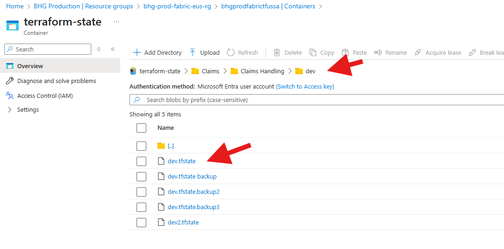
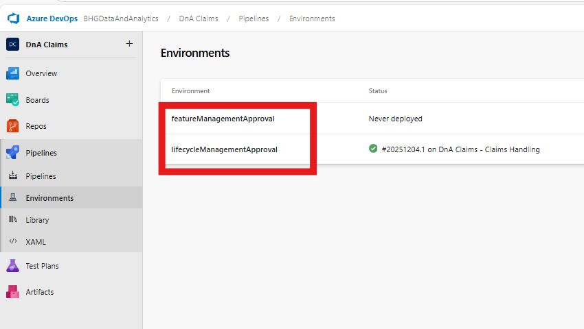

# Platform Services Variable Groups

## Table of Contents
- [Overview](#overview)
- [Variable Group Naming Convention](#variable-group-naming-convention)
- [Reserved Properties](#reserved-properties)
  - [Reserved Platform Services Variable Group Properties](#reserved-platform-services-variable-group-properties)
    - [Workspace Manage Access - Admin Users](#workspace-manage-access---admin-users)
    - [Workspace Manage Access - Admin Service Principal](#workspace-manage-access---admin-service-principal)
    - [Workspace Manage Access - Admin Service Account](#workspace-manage-access---admin-service-account)
    - [Workspace Manage Access - Contributor](#workspace-manage-access---contributor)
    - [Service Principal Credendial for Terraform](#service-principal-credendial-for-terraform)
    - [Service Account Credentials for FABRIC REST API](#service-account-credentials-for-fabric-rest-api)
    - [Domain and Subdomain Workspace Settings](#domain-and-subdomain-workspace-settings)
    - [Terraform Configuration](#terraform-configuration)
    - [CI/CD Pipeline Approval](#cicd-pipeline-approval)
    - [Workspace Creation](#workspace-creation)
    - [INT Workspace Sync with Git](#int-workspace-sync-with-git)
    - [Teams Credentials Sending Release Notes Notification](#teams-credentials-sending-release-notes-notification)
  - [Reserved Domain Variable Group Properties](#reserved-domain-variable-group-properties)
    - [Fabric Capacity Configuration](#fabric-capacity-configuration)
    - [Notebook Key Vault Name Replacement](#notebook-key-vault-name-replacement)
    - [Teams Channel Link and Teams Tags](#teams-channel-link-and-teams-tags)
    - [Spark Compute Configuration](#spark-compute-configuration)
    - [Managed Private Endpoints for Blob Storage](#managed-private-endpoints-for-blob-storage)
    - [Managed Private Endpoints for Key Vault](#managed-private-endpoints-for-key-vault)
    - [Remote Shortcut Lakehouse Configuration](#remote-shortcut-lakehouse-configuration)
    - [Semantic Model Assign SQL Endpoint Id](#semantic-model-assign-sql-endpoint-id)
    - [Semantic Model Re-Map SQL Connection](#semantic-model-re-map-sql-connection)
    - [Manage Fabric Data Pipeline Connection](#manage-fabric-data-pipeline-connection)
  - [Feature Fabric Workspace Provisioning for Data Engineers](#feature-fabric-workspace-provisioning-for-data-engineers)
---

## Overview
In addition to deploying the **Platform Services release branch** to all subdomains, variable groups are created for each higher‑end environment:

- `PlatformServices-<subdomain-name>-DEV`
- `PlatformServices-<subdomain-name>-QA`
- `PlatformServices-<subdomain-name>-UAT`
- `PlatformServices-<subdomain-name>-PRD`

Each of these variable groups is selected when deploying subdomain artifacts on each Fabric workspace via the CI/CD pipeline.

---

## Variable Group Naming Convention
Variable groups follow the format:

`PlatformServices-<domain-name>-<ENV>`

Where `<ENV>` can be `DEV`, `QA`, `UAT`, or `PRD`.

---

## Reserved Properties
It is important to understand how to configure every element or property in a variable group. Certain properties are considered **reserved** and are managed differently depending on the persona:

- **Platform Services Architect**  
- **Domain Platform Architect**

### Reserved Platform Services Variable Group Properties
- These properties **must not be changed** by data product architects.  
- If modified, they will be **overwritten** with their original values during the next Platform Services release deployment.

#### Workspace Manage Access - Admin Users
Purpose: Allows Fabric workspace **admin** access for data product architects and platform services developers. Full management Fabric workspace admin access via Microsoft Entra ID security groups.

- **Key:** `ADMIN_GROUP_PRINCIPAL_IDS`  
- **Value:**  
  ```json
  [
    "6e10b2ab-dbaa-479e-88a1-02838f8a46fd",
    "e0b158e6-4d51-4c52-92c0-11c323a333a5"
  ]
  ```

   - During subdomain onboarding process, data product architect security group created as `GUARD DnA - <domain>, <subdomain> - Data Product Architetect`
   - Searching Object Id for subdomain data product architect security group `GUARD DnA - Claims, Claims Handling - Data Product Arch`.
   - Object Id is entered in the value for ADMIN_GROUP_PRINCIPAL_IDS key.
   ```
   ```   

   ```
   ```
   - Onboarding of Platform services developers security group is already in placed. 
   - Allows platform services developers full management admin access on target workspace.  
   - Searching Object Id for platform services security group `GUARD DnA - Fluidity - PlatSvc, DevOps`.
   - Object Id is entered in the value for ADMIN_GROUP_PRINCIPAL_IDS key.
   ```
   ```   

  ```
  ``` 
  - Upon CI/CD pipeline completion, target workspace manage access sets for both security groups as **admin** level.
  ```
  ``` 

   ```
   ```
#### Workspace Manage Access - Admin Service Principal
Purpose: Allows CI/CD pipeline to manage creation of Fabric artifacts using service principal, `spn-gdap-fabricpview-usercontext`. 

- **Key:** `ADMIN_SP_PRINCIPAL_IDS`  
- **Value:**  
  ```json
  [
  "ca45263d-6de5-4fa8-aba5-464c4340c107"
  ]
   
  - Searching Object Id for service principal entrprise application `spn-gdap-fabricpview-usercontext`.
  - Object Id is entered in the value for ADMIN_SP_PRINCIPAL_IDS key.
   ```
   ```   


  - Upon CI/CD pipeline completion, target workspace manage access sets service principal as **admin** level.
  ```
  ``` 


#### Workspace Manage Access - Admin Service Account
Purpose: Allows CI/CD pipeline to manage creation of Fabric artifacts using service accounts, Fabric DnA Service Account Prod, `FabricDnAServiceAccountProd@guard.com` and Fabric DnA Service Account Dev, `FabricDnAServiceAccountDev@guard.com`.

- **Key:** `ADMIN_USER_PRINCIPAL_IDS`  
- **Value:**  
  ```json
  [
  "9ae753f6-2187-4d2d-8635-5020d1536095",
  "a36522af-54ca-4d65-a8f3-3f7c27e40917"
  ]

  - Searching Object Id for service account in Microsoft Entra ID Usrs `Fabric DnA Service Account Prod`.
  - Object Id is entered in the value for ADMIN_USER_PRINCIPAL_IDS key.
   ```
   ```   


  - Upon CI/CD pipeline completion, target workspace manage access sets service accounts as **admin** level.
  ```
  ``` 


#### Workspace Manage Access - Contributor
Purpose: Contributor access for Analytics Eng, Custodian, Data Analyst, Data Eng, and Data Modeler for target workspace.

- **Key:** `CONTRIBUTOR_GROUP_PRINCIPAL_IDS`  
- **Value:**  
  ```json
  [
  "12d058e7-e71e-4172-9e6e-83f21b6c7a7d"
  ]

  - Microsoft Entra ID for security group convention name, `GUARD DnA - <domain>, <subdomain> - WS Contrib`.
  - Searching Object Id for service group `GUARD DnA - Claims, Claims Handling - WS Contrib`.
  - Object Id is entered in the value for CONTRIBUTOR_GROUP_PRINCIPAL_IDS key.
   ```
   ```   


  - Upon CI/CD pipeline completion, target workspace manage access sets security groups as **contributor** level.
  ```
  ``` 


#### Service Principal Credendial for Terraform
Purpose: Service principal credentials to create fabric artifacs mainly for Terraform.

Background: In the past Microsoft Entra supported identities for APIs creating fabric artifacts not always these identitites were supported: user, service principal and managed identities.  

- **Key:** `SUBSCRIPTION_ID`  
- **Value:** 54b793d9-b402-4390-9cb2-e18192123540

- **Key:** `TENANT_ID`  
- **Value:** d9f7f9f1-c307-4884-ae62-0b13e49b2698

- **Key:** `CLIENT_ID`  
- **Value:** b73628a9-38e4-4020-b6be-1d616c5d3ea7 `service principal application id for spn-gdap-fabricpview`

- **Key:** `CLIENT_SECRET`  
- **Value:** retrieve secret `spn-gdap-fabricpview-secret` from key vault, https://url.us.m.mimecastprotect.com/s/1az7C82K6AIW30gqs1hDTyHrLn?domain=portal.azure.com 

- **Key:** `CLIENT_OBJECT_ID`  
- **Value:** 4d363d7a-921b-402b-89ee-659dc9926642

#### Service Account Credentials for FABRIC REST API
Purpose: Service account credentials to create fabric artifacs mainly for Fabric REST API.

Background: In the past Microsoft Entra supported identities for APIs creating fabric artifacts not always these identitites were supported: user, service principal and managed identities.    

- **Key:** `SERVICE_ACCOUNT_NAME`  
- **Value:** FabricDnAServiceAccountProd@guard.com

- **Key:** `SERVICE_ACCOUNT_SECRET`  
- **Value:** retrieve secret `FabricDnAServiceAccountProd-password` from key vault, https://url.us.m.mimecastprotect.com/s/1az7C82K6AIW30gqs1hDTyHrLn?domain=portal.azure.com 


#### Domain and Subdomain Workspace Settings
Purpose: Assign this workspace to a relevant domain to help people discover the content inside it. Each workspace can be assigned to one domain. Domain-name is interchangeable with Superdomain, child domain name is the subdomain.

- **Key:** `PARENT_DOMAIN_NAME`  
- **Value:** <domain-name> i.e. Claims

- **Key:** `CHILD_DOMAIN_NAME`  
- **Value:** <subdomain-name> i.e. Claims Handling


  - Upon CI/CD pipeline completion, superdomain and subdomains are configured in the workspace settings general view.
  ```
  ``` 


#### Terraform Configuration
Purpose: You can use the Microsoft Fabric Terraform Provider to manage your Microsoft Fabric workspaces artifacts instead of using Fabric REST API.

- **Key:** `BACKEND_RG`  
- **Value:** bhg-prod-fabric-eus-rg

- **Key:** `STORAGE_ACCOUNT`  
- **Value:** bhgprodfabrictfussa

- **Key:** `CONTAINER_NAME`  
- **Value:** terraform-state

- **Key:** `ENVIRONMENT`  
- **Value:** dev

- BACKEND_RG is the azure resource group to manage Terraform state.
- STORAGE_ACCOUNT is the azure blob storage to manage Terraform state.
- CONTAINER_NAME is the azure blob storage container to manage Terraform state.
- ENVIRONMENT is a unique name for naming terraform state for each higher-end environment, <ENVIRONMENT>.tfstate; i.e. dev.tfstate.
- <ENVIRONMENT>.tfstate path is `<PARENT_DOMAIN_NAME>/<CHILD_DOMAIN_NAME>/<ENVIRONMENT>/<ENVIRONMENT>.tfstate`. It serves other purposes on other CI/CD pipelines like creating a release pipelines at subdomains, and many other cases.

  - Upon running CI/CD pipeline, create or update Terraform state for provisioning fabric artifacts.
  ```
  ``` 



#### CI/CD Pipeline Approval
Purpose: Platform services developers and data product architecs approval prior running CI/CD pipeline. Higher-end environments (DEV/QA/UAT/PROD) assigned to `lifecycleManagementApproval` and for subdomain feature branch developers assigned to `featureManagementApproval`. These environments approval are created by running `deploy-release-subdomain.yml` pipeline.

- **Key:** `PIPELINE_ENVIRONMENT_APPROVAL`  
- **Value:** lifecycleManagementApproval

`lifecycleManagementApproval`: approvers are members of security groups for both platform services, `GUARD DnA - Fluidity - PlatSvc, DevOps` and data product architects, `GUARD DnA - <domain-name> <subdomain-name> - Data Product Arch`.
`featureManagementApproval`: approvers are member of a data product architects security group, `GUARD DnA - <domain-name> <subdomain-name> - Data Product Arch` 

  - Pipeline environments approvals for platform services developers and data product architects.
  ```
  ``` 
  
 
  - CI/CD pipeline waiting for approval based on pipeline environemt.
  ```
  ``` 


#### Workspace Creation
Purpose: The CI/CD pipeline creates a Fabric workspace with the specified name and assigns it to the associated Fabric capacity. Once a workspace has been created, its name cannot be changed.

Note: Workspace names are immutable. Any attempt to rename an existing workspace will break consistency across deployments and environments.

- **Key:** `WORKSPACE_NAMES`  
- **Value:** ["Claims-ClaimsHandling-DEV"]

#### INT Workspace Sync with Git
Purpose: Performs a fabric sync from workspace `<Workspace> INT` to the subdomain's `integration_platform_services` branch.

- **Key:** `TARGET_ORGANIZATION`  
- **Value:** BHGDataAndAnalytics

- **Key:** `TARGET_PROJECT`  
- **Value:** DnA <domain-name>  `i.e. DnA Claims`

- **Key:** `TARGET_REPOSITORY`  
- **Value:** DnA <domain-name> - <subdomain-name>  `i.e. DnA Claims - Claims Handling`

  - CI/CD pipeline option to sync INT Workspace with subdomain `integration_platform_services` branch.
  ```
  ``` 


#### Teams Credentials Sending Release Notes Notification
Purpose: Generate a token to notify Teams of recent platform services and subdomain release branch notes on-behalf user, `GUARD_DnA_Teams_Notification@guard.com`.

- **Key:** `TEAMS_CLIENT_ID`  
- **Value:** 684fdaf3-73b2-4114-92c1-3d4ca6fb0107

- **Key:** `TEAMS_CLIENT_SECRET`  
- **Value:** retrive secret, spn-gdap-teams-notification-secret, from key vault link, https://url.us.m.mimecastprotect.com/s/IpgfC73VLzu2MKYNF8fRTo3UZF?domain=portal.azure.com

- **Key:** `TEAMS_CLIENT_OBJECT_ID`  
- **Value:** d2842783-b68d-4210-b46a-5cc559c621a2

- **Key:** `TEAMS_NOTIFICATION_USERNAME`  
- **Value:** GUARD_DnA_Teams_Notification@guard.com

- **Key:** `TEAMS_NOTIFICATION_PASSWORD `  
- **Value:** retrieve secret, GUARDDnATeamsNotification-ServiceAccount-password, from key vault link, https://url.us.m.mimecastprotect.com/s/IpgfC73VLzu2MKYNF8fRTo3UZF?domain=portal.azure.com


## Reserved Domain Variable Group Properties
- These properties **may be changed** by data product architects.  
- If modified, they will be **not overwritten** during the next Platform Services release deployment..

#### Fabric Capacity Configuration
Purpose: Fabric capacity is provisioned at the domain level and shared across its subdomains. Capacity is assigned only when a new workspace is created, not during routine workspace updates. Because CI/CD pipelines currently cannot modify capacity for existing workspaces, any changes must be performed manually or through a script. When updating, replace the previous capacity_id value with the new one in the variable group for all higher‑end environments (DEV, QA, UAT, PRD). Note: PRD may have a different capacity id based on data pipelines workload.

- **Key:** `CAPACITY_ID`  
- **Value:** 7CEEEC90-3EDE-4120-93CD-7D96FB60EE65

  - Upon CI/CD pipeline completion, target workspace settongs `License info` SKU Capaciy ID should be displayed.
  ```
  ``` 


#### Notebook Key Vault Name Replacement
Purpose: Platform Services provide a notebook (den_nbk_pdi_001_workspace_parameters) that defines a secret scope name as a variable. This scope is referenced by other notebooks. During deployment, the CI/CD pipeline replaces the Platform Services secret scope with the appropriate subdomain Key Vault name. The pipeline searches for the "secretScope =" pattern and updates it with the domain‑specific Key Vault name value.
Note: The pattern "secretScope =" must remain unchanged. Altering it will break the CI/CD pipeline’s ability to correctly replace the subdomain Key Vault name.

- **Key:** `KEYVAULT_NAME`  
- **Value:** bhg-dev-claimshdl-eus-kv


#### Teams Channel Link and Teams Tags
Purpose: A Teams channel link is required to send messages containing release branch notes from either Platform Services or subdomains. Platform Services use the channel Platform Services - DevOps Release Notes for this purpose.

The Data Product Manager should create a public Guard channel so that Data Product Architects can post their release branch notes. Teams tags identify specific users who should be notified when release notes are sent. These tags must already exist in the Teams channel to be valid recipients.

- **Key:** `TEAMS_CHANNEL_WEB_URL`  
- **Value:** https://teams.microsoft.com/l/channel/19%3A9b5fd59639ef443097b95e1e51c5f050%40thread.tacv2/Platform%20Services%20-%20DevOps%20Release%20Notes?groupId=8f3ce823-54d1-4cb2-986a-ccbfdad9d9c2&tenantId=d9f7f9f1-c307-4884-ae62-0b13e49b2698

  - View to acquire Teams channel link.
  ```
  ``` 


- **Key:** `TEAMS_TAGS`  
- **Value:** Executive, Data Product Manager, Domain Scrum Master, Data Product Architect, Internal Audit/MARS, DnA Leadership

#### Spark Compute Configuration
Purpose: The spark compute configuration applies to all notebooks and and Spark job definitions per each higher-end environment (DEV/QA/UAT/PRD).

- **Key:** `sparkCompute.driver_cores`  
- **Value:** 4

- **Key:** `sparkCompute.driver_memory`  
- **Value:** 28g

- **Key:** `sparkCompute.executor_cores`  
- **Value:** 1

- **Key:** `sparkCompute.executor_memory`  
- **Value:** 28g

- **Key:** `sparkCompute.max_executors`  
- **Value:** 1

- **Key:** `sparkCompute.min_executors`  
- **Value:** 1

- **Key:** `sparkCompute.runtime_version`  
- **Value:** 1.3

  - View of spark environment compute after CI/CD pipeline runs.
  ```
  ``` 


#### Managed Private Endpoints for Blob Storage
Purpose: This configuration creates and approves managed private endpoints for a blob storage resource ID. The private endpoint name follows the convention:

`<domain>-<subdomain>-<DEV/QA/UAT/PRD>-<storage-account-name>`

The CI/CD pipeline enforces creation and approval of private endpoints but does not remove existing ones. Any removal must be performed manually in Fabric Workspace Settings → Outbound Networking.

pep.blob.allowed

true: Enforces creation and approval of the storage account private endpoint.

false: Skips creation and approval of the storage account private endpoint.

pep.blob.resourceId

The Azure Storage Account resource ID.

pep.blob.subresourceType

Reserved for the storage account resource type `blob`.

- **Key:** `pep.blob.allowed`  
- **Value:** false

- **Key:** `pep.blob.resourceId`  
- **Value:** /subscriptions/54b793d9-b402-4390-9cb2-e18192123540/resourceGroups/bhg-prod-fabric-eus-rg/providers/Microsoft.Storage/storageAccounts/bhgprodfabricedoussa

- **Key:** `pep.blob.subresourceType`  
- **Value:** blob

  - View workspace settings outbound networking for private endpoint storage account.
  ```
  ``` 


#### Managed Private Endpoints for Key Vault
Purpose: This configuration creates and approves managed private endpoints for a key vault resource ID. The private endpoint name follows the convention:

`<domain>-<subdomain>-<DEV/QA/UAT/PRD>-<key-vault-name>`

The CI/CD pipeline enforces creation and approval of private endpoints but does not remove existing ones. Any removal must be performed manually in Fabric Workspace Settings → Outbound Networking.

pep.vault.allowed

true: Enforces creation and approval of the key vault private endpoint.

false: Skips creation and approval of the key vault private endpoint.

pep.vault.resourceId

The Azure Key Vault resource ID.

pep.vault.subresourceType

Reserved for the storage account resource type `vault`.

- **Key:** `pep.vault.allowed`  
- **Value:** false

- **Key:** `pep.vault.resourceId`  
- **Value:** /subscriptions/3a2539e2-7efe-40cb-b451-10953168fd56/resourceGroups/bhg-hub-fabric-eus-rg/providers/Microsoft.KeyVault/vaults/bhg-hub-fabric01-eus-kv

- **Key:** `pep.vault.subresourceType`  
- **Value:** vault

  - View workspace settings outbound networking for private endpoint key vault.
  ```
  ``` 


#### Remote Shortcut Lakehouse Configuration
Purpose:This configuration enables the creation of a lakehouse shortcut in the current workspace so it can access a target lakehouse located in another workspace.

The property `shortcut.<shortcutname>.workspace` should be set by replacing `<shortcutname>` with the name defined in the shortcut.metadata.json file. Similarly, `shortcut.<shortcutname>.lakehouse` specifies the target lakehouse name.

- **Key:** `shortcut.shortcutname.workspace`  
- **Value:** `<workspace-name>`

- **Key:** `shortcut.shortcutname.lakehouse`  
- **Value:** `<lakehouse-name>`

Given a lakehouse shortcut.metadata.json file
  ```json
[
  {
    "name": "dim_date_trans_date",
    "path": "/Tables/claims_transaction",
    "target": {
      "type": "OneLake",
      "oneLake": {
        "path": "Tables/claims_transaction/dim_date",
        "itemId": "00000000-0000-0000-0000-000000000000",
        "workspaceId": "00000000-0000-0000-0000-000000000000"
      }
    }
  },
  {
    "name": "dim_date_loss_date",
    "path": "/Tables/claims_transaction",
    "target": {
      "type": "OneLake",
      "oneLake": {
        "path": "Tables/claims_transaction/dim_date",
        "itemId": "00000000-0000-0000-0000-000000000000",
        "workspaceId": "00000000-0000-0000-0000-000000000000"
      }
    }
  }
]
```

Accessing a remote target lakehouse shortcut from another workspace is required because the workspaceId and itemId fields in the shortcut.metadata.json file may be empty, preventing identification of the remote workspace and lakehouse. These values must be explicitly defined in the variable group.

- **Key:** `shortcut.dim_date_trans_date.workspace` 
- **Value:** Claims-ClaimsHandling-DEV

- **Key:** `shortcut.dim_date_trans_date.lakehouse`  
- **Value:** den_lhw_dpr_001_claims_transaction

- **Key:** `shortcut.dim_date_loss_date.workspace`  
- **Value:** Claims-ClaimsHandling-DEV

- **Key:** `shortcut.dim_date_loss_date.lakehouse`  
- **Value:** den_lhw_dpr_001_claims_transaction

#### Semantic Model Assign SQL Endpoint Id
Purpose: When deploying Direct‑Lake semantic models to higher‑end environments, all *.tmdl files must be scanned to update SQL database expressions. The first parameter should be replaced with the correct SQL connection string, and the second parameter with the correct lakehouse SQL endpoint ID. This is necessary because feature branch developers often push their own lakehouse SQL connection string and endpoint ID into DevOps Git.

The CI/CD pipeline searches for the following pattern:

`Sql.Database("<sql-connection-string>.datawarehouse.fabric.microsoft.com", "<any-guid-value>")`

It then replaces `<sql-connection-string>` and `<any-guid-value>` with the variable group key `sm.semanticmodelname.newValue`, which corresponds to the `<lakehouse-name>`. This ensures both the SQL connection string and SQL endpoint ID are correctly aligned with the target environment.

Configuration:

- **Key:** `sm.semanticmodelname.newValue`  
- **Value:** `<lakehouse-name>`

Example: Given the semantic model `pbi_dst_001_claims_transactions`, the database query initially appears as:

expression DatabaseQuery =
    let
        database = Sql.Database("6H47PWIHYOCERLTCBMJ6JGZGTA-2BPU5FY3CW4E7MFDDKKZCBMJXE.datawarehouse.fabric.microsoft.com", "ffcbf3a6-7eb8-4518-a52e-7b3c87a975ed")
    in
        database
lineageTag: 547eba57-d5fb-4e01-aac1-d3cee366d4b6


The following changes are required to replace the current lakehouse name in the database query with its correct SQL endpoint ID:

- **Key:** `sm.pbi_dst_001_claims_transactions.newValue`  
- **Value:** `den_lhw_dpr_001_claims_transaction`

  - View of original database query in expressions.tmdl file, to replace SQL connection string and SQL endpoint ID.
  ```
  ``` 


#### Semantic Model Re-Map SQL Connection
Purpose: This configuration allows a semantic model to re‑map its data source from the default single‑sign‑on to a cloud SQL connection. During deployment, the CI/CD pipeline binds the semantic model’s data source reference to the specified SQL connection, ensuring consistency across environments.

- **Key:** `sm.semanticmodelname.connectionName`  
- **Value:** `<connection-name>`

Example: For the semantic model `pbi_dst_pdq_001_dq_dataquality`, the connection name is defined as `DQ_DEV_03`. The variable group key/value pair should be configured as:

- **Key:** `sm.pbi_dst_pdq_001_dq_dataquality.connectionName`  
- **Value:** `DQ_DEV_03`

  - View of semantic model gateway cloud connections afer CI/CD pipeline run to re-map a data connection.
  ```
  ``` 


#### Manage Fabric Data Pipeline Connection
Purpose: When deploying to higher‑end environments (DEV/QA/UAT/PRD), provisioning Fabric data pipelines with the correct data connection can be challenging. This is because the GUIDs for connections are often tied to the feature developer’s data connection when pushed to DevOps Git.

Since data connections are globally defined, they may work without additional configuration in lower environments (DEV/QA). However, deployments to UAT/PRD typically require explicit configuration to ensure the correct data source connections are selected.

How It Works: 

Three variable group key/value pairs are used to manage and remap connections:

- **Key:** `mngConnection.<any-name>.guid`  
- **Value:** `<GUID>`

- **Key:** `mngConnection.<any-name>.new-name`  
- **Value:** `<connection-name>`

- **Key:** `mngConnection.<any-name>.original-name`  
- **Value:** `<connection-name>`

The pipeline logic:

1. `mngConnection.<any-name>.original-name` lists all data source connections and finds a match for the original connection name stored in DevOps Git.

2. It verifies the associated `mngConnection.<any-name>.guid`.

3. If matched, the old GUID is replaced with the GUID of `mngConnection.<any-name>.new-name` by performing a lookup.

Example: In a higher‑end PRD workspace, you may need to change the GUID from FabricDataPipelines-DevOps-DEV to FabricDataPipelines-DevOps-PRD. The Fabric data pipeline initially only recognizes the DEV GUID, so the configuration ensures it is replaced with the PRD GUID.

View the managed connection for FabricDataPipelines-DevOps-DEV and record its connection ID.
  ```
  ``` 


Update the variable group accordingly.

Configuration:

- **Key:** `mngConnection.DataPipeline.guid`  
- **Value:** `ed22cf49-cea1-4171-ac69-28ae3fe2b9f1`

- **Key:** `mngConnection.DataPipeline.original-name`  
- **Value:** `FabricDataPipelines-DevOps-DEV`

- **Key:** `mngConnection.DataPipeline.new-name`  
- **Value:** `FabricDataPipelines-DevOps-PRD`


---

## Feature Fabric Workspace Provisioning for Data Engineers

**Overview:**
- **Purpose:** Step-by-step instructions to create a feature workspace in DevOps by cloning the PlatformServices Dev variable group and wiring it into pipelines.
- **Scope:** This guide covers cloning the variable group, updating secrets and environment values, associating with pipelines, and the basic validation steps.

**Prerequisites:**
- **Permissions:** You must have `Project Administrator` or `Contributor` access in the Azure DevOps project and rights to manage variable groups.
- **Service Principal:** A service principal with necessary Azure permissions for provisioning resources (ARM_CLIENT_ID, ARM_CLIENT_SECRET, ARM_TENANT_ID).

**Steps:**

1. Clone the PlatformServices Dev variable group
- Navigate to the Azure DevOps project -> Pipelines -> Library -> Variable groups.
- Locate the existing variable group named something like `PlatformServices-<SubDomainName>-Dev` (e.g. `PlatformServices-DelegatedAuthority-DEV`).
- Use the clone action to create a new variable group for your feature workspace. Name it using the pattern `<SuperDomain>-<SubDomainName>-Feature-<data-engineer-name>` (e.g. `Distribution-DelegatedAuthority-Feature-hansolo`).

  **01 - Select DevOps Project**
    

    
    

  **02 - Variable groups list**
    

    
     

  **03 - Clone variable group**
    

    
    

  **04- Rename variable group**
    

    

2. Update variables in the cloned variable group
- Open your new `<SuperDomain>-<SubDomainName>-Feature-<data-engineer-name>` variable group.
- Update the following key variables (example names):
  - `CLIENT_ID` — service principal client id
  - `CLIENT_SECRET` — service principal secret (mark as secret)
    

    
    

  - `TENANT_ID` — Azure tenant id
    

    
    

  - `SERVICE_ACCOUNT_NAME` - Service account name
  - `SERVICE_ACCOUNT_SECRET` - Service account secret key
    

    
    

  - `ENVIRONMENT` — set to `<data-engineer-name>` (e.g. `hansolo`)
    

    
    

  - `KEYVAULT_NAME` - Key vault name
    

    
  - `TEAMS_CLIENT_SECRET` - Teams client secret key
  - `TEAMS_NOTIFICATION_PASSWORD` - Teams notification password
    

    
    

  - `WORKSPACE_NAMES` — set to `["<SuperDomain>-<SubDomainName>-Feature-<data-engineer-name>"]` e.g.(`["Distribution-DelegatedAuthority-Feature-hansolo"]`)
    
    

**Run Pipeline:**

Follow these steps to queue the pipeline that creates the feature workspace. Use the three screenshots below to verify the dialog fields (highlighted boxes) before running.

1. Navigate to Pipelines -> Pipelines in Azure DevOps and locate the pipeline used for feature workspace creation (common names include `<SuperDomain> - <SubDomainName>` or the pipeline defined for your subdomain e.g. `DnA Distribution - Delegated Authority`). Click the pipeline name, then click **Run pipeline**.
  

  
  

  
  _Pipline Selection - Pipeline Name and run pipeline highlighted_

2. In the **Run pipeline** dialog:
  - **Branch (highlighted):** select the branch to run from (usually your feature branch).
  - **Variables / Variable groups (highlighted):** open the variables area to select the cloned variable group. Choose the `<SuperDomain>-<SubDomainName>-Feature-<data-engineer-name>` group you created earlier.

3. The highlighted parameters in the run pipeline dialog are the pipeline's default selections and should NOT be modified during the first-time creation of a feature workspace.

4. Click **Run** to start the pipeline. Monitor the pipeline logs and wait for provisioning to complete. On success, the new workspace specified in `WORKSPACE_NAMES` will be created.

  
    
  _Pipeline Dialog-Select branch, add variable grou and run._

