# Platform Services Variable Groups

## Table of Contents
- [Overview](#overview)
- [Variable Group Naming Convention](#variable-group-naming-convention)
- [Variable Group Security Role Permissions](#variable-group-security-role-permissions)
- [Reserved Properties](#reserved-properties)
  - [Reserved Platform Services Variable Group Properties](#reserved-platform-services-variable-group-properties)
    - [Workspace Manage Access - Admin Users](#workspace-manage-access---admin-users)
    - [Workspace Manage Access - Admin Service Principal](#workspace-manage-access---admin-service-principal)
    - [Workspace Manage Access - Admin Service Account](#workspace-manage-access---admin-service-account)
    - [Workspace Manage Access - Contributor](#workspace-manage-access---contributor)
    - [Service Principal Credendial](#service-principal-credendial)
    - [Service Account Credentials for FABRIC REST API](#service-account-credentials-for-fabric-rest-api)
    - [Domain and Subdomain Workspace Settings](#domain-and-subdomain-workspace-settings)
    - [CI-CD Pipeline Approval](#ci-cd-pipeline-approval)
    - [Workspace Creation](#workspace-creation)
    - [INT Workspace Sync with Git](#int-workspace-sync-with-git)
    - [Teams Credentials Sending Release Notes Notification](#teams-credentials-sending-release-notes-notification)
    - [How Notifications Are Sent by Create Release Pipeline](#how-notifications-are-sent-by-create-release-pipeline)
    
  - [Reserved Domain Variable Group Properties](#reserved-domain-variable-group-properties)
    - [Fabric Capacity Configuration](#fabric-capacity-configuration)
    - [Notebook Key Vault Name Replacement](#notebook-key-vault-name-replacement)
    - [Teams Channel Link and Teams Tags](#teams-channel-link-and-teams-tags)
    - [Spark Compute Configuration](#spark-compute-configuration)
    - [Managed Private Endpoints for Blob Storage](#managed-private-endpoints-for-blob-storage)
    - [Managed Private Endpoints for Key Vault](#managed-private-endpoints-for-key-vault)
    - [Remote Shortcut Lakehouse Configuration](#remote-shortcut-lakehouse-configuration)
    - [Lakehouse OneLake Security Default Roles](#lakehouse-onelake-security-default-roles)
    - [Semantic Model Assign SQL Endpoint Id](#semantic-model-assign-sql-endpoint-id)
    - [Semantic Model Re-Map SQL Connection](#semantic-model-re-map-sql-connection)
    - [Semantic Model Map Gateway Based-OneLake Connection-Direct lake](#semantic-model-map-gateway-based-onelake-connection-direct-lake)
    - [Semantic Model Map SQL Connection - Import mode](#semantic-model-map-sql-connection-import-mode)
    - [Manage Fabric Data Pipeline Connection](#manage-fabric-data-pipeline-connection)
  - [Feature Fabric Workspace Provisioning for Data Engineers](#feature-fabric-workspace-provisioning-for-data-engineers)
  - [Variable Group Cloning Automation Pipeline](#variable-group-cloning-automation-pipeline)
  - [Setting Schedules-Fabric items](#setting-schedules-fabric-items)
---

## Overview
A variable group in Azure DevOps is a centralized collection of key/value settings (including secrets) that pipelines use at run time. In this project, variable groups provide environment-specific configuration for each subdomain deployment.

Advantages of using variable groups:
- Centralized configuration management for DEV, QA, UAT, and PRD.
- Reusable values across multiple pipelines, reducing duplicate configuration.
- Safer secret handling through Azure DevOps secret variables.
- Faster and more consistent deployments by standardizing runtime values per environment.

In addition to deploying the **Platform Services release branch** to all subdomains, variable groups are created for each higher-end environment:

- `PlatformServices-<subdomain-name>-DEV`
- `PlatformServices-<subdomain-name>-QA`
- `PlatformServices-<subdomain-name>-UAT`
- `PlatformServices-<subdomain-name>-PRD`

Each of these variable groups is selected when deploying subdomain artifacts to the target Fabric workspace through the CI/CD pipeline.

How developers use variable groups during pipeline execution:
1. Select the target branch and choose the environment-specific variable group when running the pipeline.
2. The pipeline loads values from that variable group and applies them to deployment tasks (for example workspace settings, approvals, credentials, and environment-specific mappings).
3. The same pipeline definition can deploy to the correct Fabric workspace environment (DEV/QA/UAT/PRD) by switching only the selected variable group.

---

## Variable Group Naming Convention
Variable groups use a consistent naming format so teams can quickly identify the platform scope, target domain/subdomain, and deployment environment before running a pipeline:

`PlatformServices-<domain-name>-<ENV>`

Naming details:
- `PlatformServices` identifies the shared platform deployment model.
- `<domain-name>` identifies the target subdomain/domain context defined in the subdomain configuration.
- `<ENV>` identifies the Fabric workspace environment the deployment targets. `<ENV>` are `INT`, `DEV`, `QA`, `UAT`,`ANA` `PREPRD` or `PRD`

Environment reference:
- `INT`: Integration environment for combined testing across components.
- `DEV`: Development environment for implementation and early validation.
- `QA`: Quality Assurance environment for formal testing and defect validation.
- `UAT`: User Acceptance Testing environment for business/user sign-off.
- `ANA`: Analytics-focused environment for analyst validation and reporting checks.
- `PREPRD`: Pre-production environment used for final production-readiness checks.
- `PRD`: Production environment used by end users and business operations.

Example variable group names:
- `PlatformServices-ClaimsHandling-INT`
- `PlatformServices-ClaimsHandling-DEV`
- `PlatformServices-ClaimsHandling-QA`
- `PlatformServices-ClaimsHandling-UAT`
- `PlatformServices-ClaimsHandling-ANA`
- `PlatformServices-ClaimsHandling-PREPRD`
- `PlatformServices-ClaimsHandling-PRD`

How variable groups are provisioned for subdomain deployments:
1. The subdomain deployment pipeline reads predefined JSON configuration files from `DevOpsServices/pipelines/subdomains`.
2. Each JSON file defines deployment metadata such as `targetVariableGroup`, `targetWorkspaceName`, `environment`, and other environment-specific values.
3. During execution, the pipeline processes these configuration files in sequence/matrix mode so all configured subdomains are deployed using their mapped variable groups.
4. For each subdomain, the selected variable group supplies the environment values used to deploy subdomain artifacts into the correct Fabric workspace.

This model ensures standardized naming, predictable provisioning behavior, and consistent deployment settings across all subdomains.

---

## Variable Group Security Role Permissions

Each Azure DevOps variable group has security roles applied at two levels: **explicitly managed** groups (driven by the subdomain config) and **inherited** project groups (set automatically by Azure DevOps and overridden by Release Deployment Pipeline).

### Administrator role — explicitly managed via `variableGroupAdmins`

Each subdomain JSON config file in [DevOpsServices/pipelines/subdomains](DevOpsServices/pipelines/subdomains) contains a `variableGroupAdmins` property — a comma-separated list of Microsoft Entra security group names. These are the groups that will be granted the **Administrator** role on the variable group.

The CI/CD pipeline passes that value to [DevOpsServices/pipelines/scripts/Set-Variable-Group-Permissions.ps1](DevOpsServices/pipelines/scripts/Set-Variable-Group-Permissions.ps1#L1), which:
1. Resolves each group name via the Azure DevOps IdentityPicker API to get its `localId`.
2. Sets all resolved groups as `Administrator` on the variable group (can read, use, and manage the variable group).
3. Any group that was previously `Administrator` but is **not** in the new `variableGroupAdmins` list is downgraded to `User`.

**Environment policy for `variableGroupAdmins`:**

| Environment | Groups granted Administrator |
|---|---|
| `PRD` | Data Product Engineers only — e.g. `GUARD DnA - <Domain> <Subdomain> - Data Eng`, Consultant Engineers e.g. `GUARD DnA - <Domain> <Subdomain> - Data Eng  - Consultant` are restricted|
| `INT`, `DEV`, `QA`, `UAT` etc. | Data Product Architect **and** Data Engineer — e.g. `GUARD DnA - <Domain> <Subdomain> - Data Product Arch, GUARD DnA - <Domain> <Subdomain> - Data Eng` |

Examples from the subdomains folder:
- PRD: [DevOpsServices/pipelines/subdomains/claims_handling_prd.json](DevOpsServices/pipelines/subdomains/claims_handling_prd.json#L32)
- DEV: [DevOpsServices/pipelines/subdomains/claims_handling_dev.json](DevOpsServices/pipelines/subdomains/claims_handling_dev.json#L32)

### Feature-specific variable groups — manual administrator access

For feature-specific variable groups, administrator access should be handled as a **manual request** and should **not** be provisioned through the automated `variableGroupAdmins` process.

How new users are added as administrators for feature-specific variable groups:
1. Raise a manual request to the Platform Services team or the Azure DevOps Project Administrators for the target feature variable group.
2. In Azure DevOps, open **Pipelines -> Library -> Variable groups**, select the feature-specific variable group, and open its **Security** settings.
3. Add the required user or Microsoft Entra security group and assign the **Administrator** role.
4. Validate that the new administrator can read, use, update, and manage permissions for that feature-specific variable group.

This manual approach is recommended for feature-specific variable groups so access can be reviewed and approved case by case, without changing the automated permission model used for standard subdomain environment variable groups.

### User and Reader roles — inherited Azure DevOps project groups

The remaining groups visible on the variable group's security panel are **inherited** from the Azure DevOps project. The script explicitly sets inheritance to `false` on the variable group and reassigns these groups with `User` or `Reader` roles to restrict their access — ensuring no unintended elevated permissions are inherited from the project level. Their roles are:

| Group | Role |
|---|---|
| `[<Project>]\Build Administrators` | User |
| `[<Project>]\Project Administrators` | User |
| `[<Project>]\Release Administrators` | User |
| `[<Project>]\Contributors` | Reader |
| `[<Project>]\Project Valid Users` | Reader |
| `<Project> Build Service (<Org>)` | Reader |

- **User** role: can reference and queue pipelines using the variable group but cannot modify it.
- **Reader** role: read-only access; cannot use the variable group in pipelines directly.
- **Administrator** role: full control — can read, use, update, and manage permissions on the variable group.

***Variable Group Security Role Permissions Example:***

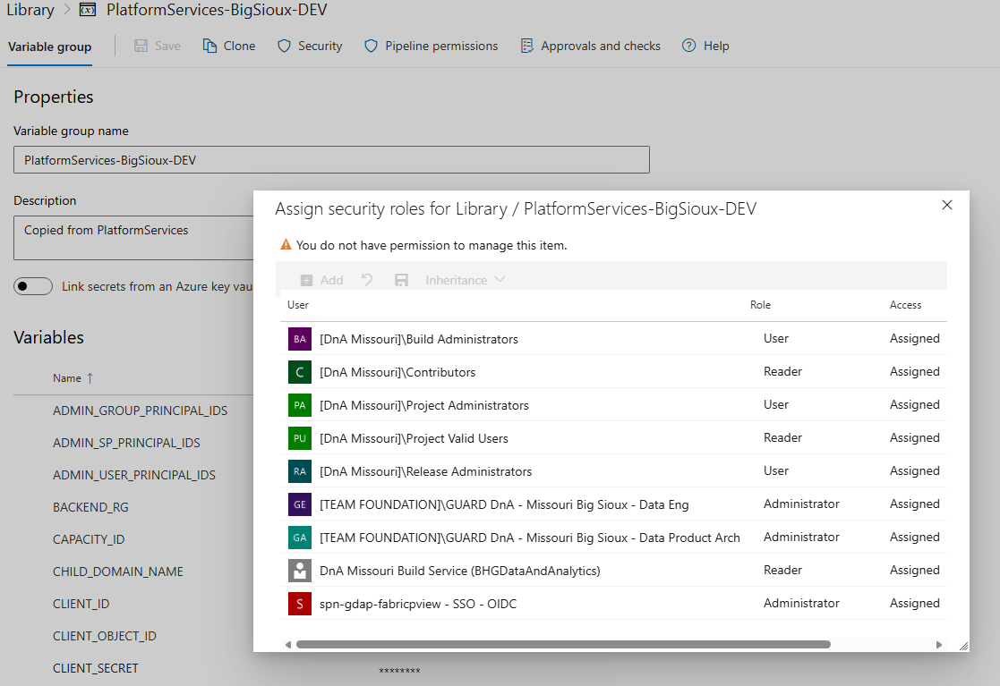


## Reserved Properties
Variable groups contain many settings, but not all of them should be changed by every user. Some settings are considered **reserved properties**.

In simple terms, reserved properties are protected configuration values that the deployment process depends on to work correctly. They control important behavior such as workspace access, credentials, environment configuration, approvals, and deployment mappings. If these values are changed incorrectly, pipeline runs may fail, security access may break, or artifacts may be deployed to the wrong Fabric workspace or environment.

Think of reserved properties as settings that support the platform's core plumbing. Some of them are owned and maintained by the Platform Services team, while others are intended to be updated by domain teams for their own environment-specific needs.

The way these reserved properties are managed depends on the user persona:

- **Platform Services Architect**  
- **Domain Platform Architect**

### Reserved Platform Services Variable Group Properties

Platform Services properties are configuration values owned and managed exclusively by the Platform Services team. These properties control core infrastructure functions such as workspace access, authentication, deployment service principals, CI/CD pipeline approvals, Terraform state management, and platform notifications.

**Why are these properties reserved?**
These properties must remain consistent across all subdomains and environments to ensure the CI/CD deployment pipeline works reliably. If data product architects or domain teams were to modify them, it could break authentication, pipeline deployments, workspace access, or artifact promotion—potentially affecting the entire platform.

**Who manages Platform Services properties?**
Only the **Platform Services Architect** persona is authorized to change Platform Services properties. The Platform Services team updates these values during platform releases to maintain security, fix issues, or add new capabilities.

**What happens if they are modified?**
If a data product architect accidentally or intentionally changes a Platform Services property, it will be automatically **overwritten** with its correct Platform Services value the next time a release deployment runs. This safety mechanism ensures platform integrity is maintained and prevents misconfigurations.

**Can I request changes to Platform Services properties?**
Yes. If you believe a Platform Services property needs to be updated for your specific use case or environment, contact the Platform Services team to request a change. They will review the request and update the property if appropriate, ensuring all subdomains remain consistent and aligned.

The Platform Services properties that are reserved include workspace access roles, service principal credentials, CI/CD approvals, Teams integration, and environment promotion settings. See the subsections below for details on each property and its purpose.

#### Workspace Manage Access - Admin Users

**Purpose:** This property grants **admin-level access** to the Fabric workspace for specific Microsoft Entra ID security groups. Admin access allows members of these groups to create, modify, and delete workspace items, manage workspace settings, and control access for other users.

**What does this property do?**
When the CI/CD pipeline completes deployment, it uses this property to automatically set the specified security groups as administrators on the target Fabric workspace. This grants full management permissions to the workspace for members of those groups.

**Which groups receive admin access?**
Two security groups are granted admin access:
1. **Data Product Architect group** — Created during subdomain onboarding (e.g., `GUARD DnA - Claims, Claims Handling - Data Product Arch`). This group contains the architects responsible for the subdomain.
2. **Platform Services Developer group** — Pre-configured as `GUARD DnA - Fluidity - PlatSvc, DevOps`. This group contains the Platform Services team who manage the core deployment infrastructure.

**How is this property configured?**

- **Key:** `ADMIN_GROUP_PRINCIPAL_IDS`  
- **Value:** An array of Microsoft Entra ID object IDs (GUIDs) representing the security groups above.

Example:
```json
[
  "6e10b2ab-dbaa-479e-88a1-02838f8a46fd",  // Data Product Architect group
  "e0b158e6-4d51-4c52-92c0-11c323a333a5"   // Platform Services Developer group
]
```

**How to find the object IDs:**

1. **For the Data Product Architect group:**
   - Search Microsoft Entra ID for the security group `GUARD DnA - <domain>, <subdomain> - Data Product Arch` (e.g., `GUARD DnA - Claims, Claims Handling - Data Product Arch`).
   - Copy its object ID (a GUID).
   - Add it to the `ADMIN_GROUP_PRINCIPAL_IDS` array in the variable group.

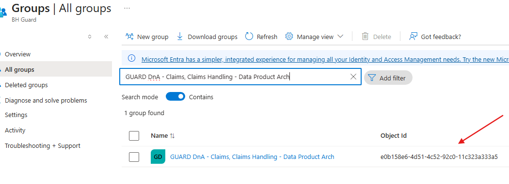

2. **For the Platform Services Developer group:**
   - Search Microsoft Entra ID for `GUARD DnA - Fluidity - PlatSvc, DevOps`.
   - Copy its object ID.
   - Add it to the `ADMIN_GROUP_PRINCIPAL_IDS` array.

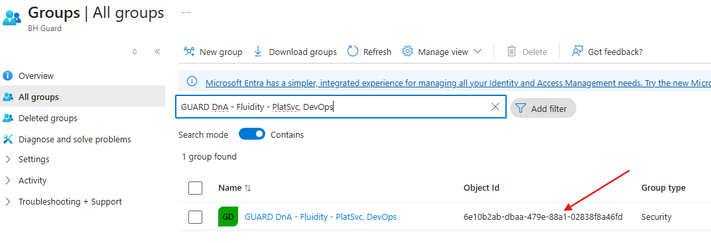

**What happens after deployment?**
Once the CI/CD pipeline completes, both security groups will appear in the Fabric workspace's **Manage Access** panel with the **Admin** role. Members of these groups can then manage the workspace without needing additional manual access grants.

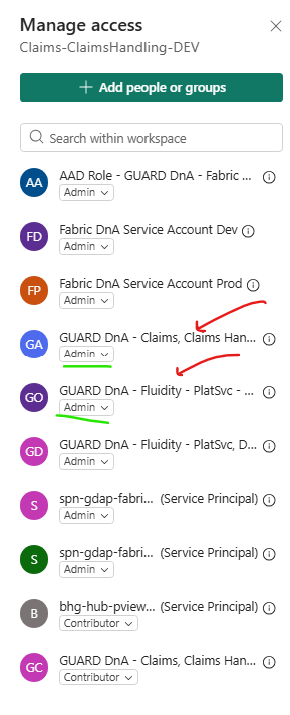
#### Workspace Manage Access - Admin Service Principal
Purpose: Allows CI/CD pipeline to manage creation of Fabric artifacts using service principal, `spn-gdap-fabricpview-usercontext`. 

- **Key:** `ADMIN_SP_PRINCIPAL_IDS`  
- **Value:**  
  ```json
  [
  "ca45263d-6de5-4fa8-aba5-464c4340c107"
  ]
   
  - Searching Object Id for service principal entrprise application `spn-gdap-fabricpview-usercontext`.
  - Object Id is entered in the value for ADMIN_SP_PRINCIPAL_IDS key.
   ```
   ```   
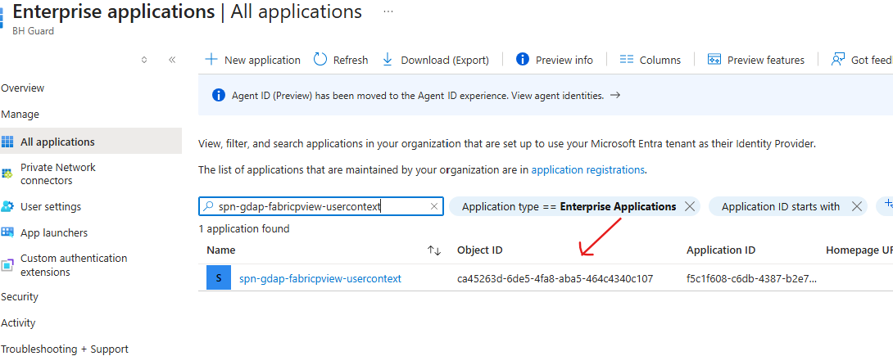

  - Upon CI/CD pipeline completion, target workspace manage access sets service principal as **admin** level.
  ```
  ``` 
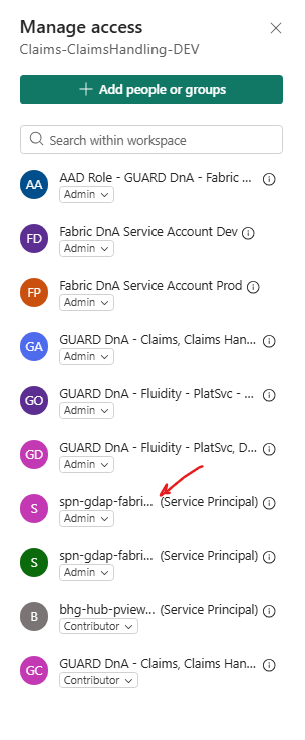

#### Workspace Manage Access - Admin Service Account
Purpose: Allows CI/CD pipeline to manage creation of Fabric artifacts using service accounts, Fabric DnA Service Account Prod, `FabricDnAServiceAccountProd@guard.com` and Fabric DnA Service Account Dev, `FabricDnAServiceAccountDev@guard.com`.

- **Key:** `ADMIN_USER_PRINCIPAL_IDS`  
- **Value:**  
  ```json
  [
  "9ae753f6-2187-4d2d-8635-5020d1536095",
  "a36522af-54ca-4d65-a8f3-3f7c27e40917"
  ]

  - Searching Object Id for service account in Microsoft Entra ID Usrs `Fabric DnA Service Account Prod`.
  - Object Id is entered in the value for ADMIN_USER_PRINCIPAL_IDS key.
   ```
   ```   
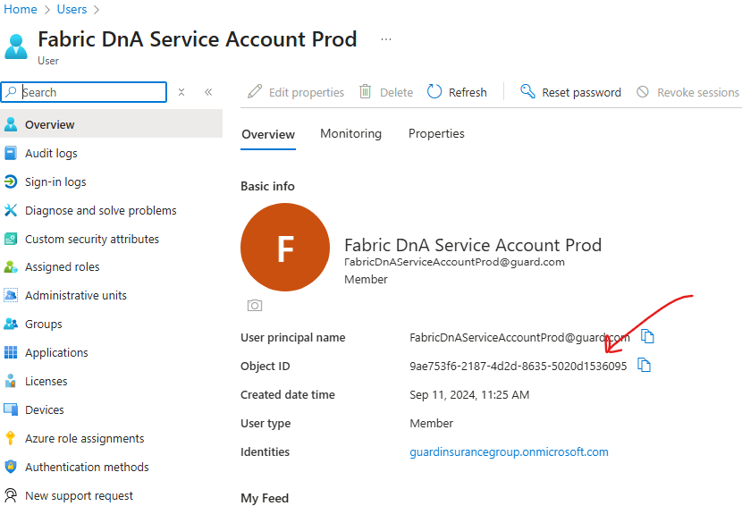

  - Upon CI/CD pipeline completion, target workspace manage access sets service accounts as **admin** level.
  ```
  ``` 
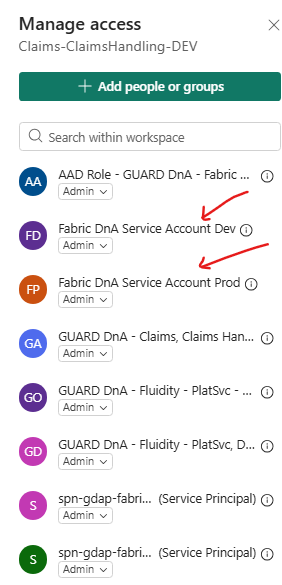

#### Workspace Manage Access - Contributor

**Purpose:** This property grants **contributor-level access** to the Fabric workspace for data roles that need to read, create, and publish workspace content, but do not need full admin control. Contributors can work with workspace artifacts such as notebooks, lakehouses, and data pipelines without being able to manage workspace settings or control access for other users.

**What does this property do?**
When the CI/CD pipeline completes deployment, it automatically assigns the specified security group as a contributor on the target Fabric workspace. This ensures that all relevant data roles for the subdomain have the right level of access to work effectively in the workspace without being over-privileged.

**Which roles receive contributor access?**
Contributor access is granted to the combined workspace contributor security group, which includes members from the following data roles:
- **Analytics Engineer** — builds and maintains data models and transformations.
- **Custodian** — manages data governance and ensures data quality standards.
- **Data Analyst** — queries and explores data for business insights.
- **Data Engineer** — builds and maintains data pipelines and infrastructure.
- **Data Modeler** — designs and maintains semantic models and data structures.

All these roles are consolidated into a single Microsoft Entra ID security group following the naming convention: `GUARD DnA - <domain>, <subdomain> - WS Contrib` (e.g., `GUARD DnA - Claims, Claims Handling - WS Contrib`).

**How is this property configured?**

- **Key:** `CONTRIBUTOR_GROUP_PRINCIPAL_IDS`  
- **Value:** An array containing the Microsoft Entra ID object ID (GUID) of the workspace contributor security group.

Example:
```json
[
  "12d058e7-e71e-4172-9e6e-83f21b6c7a7d"  // WS Contrib security group
]
```

**How to find the object ID:**
- Search Microsoft Entra ID for the security group `GUARD DnA - <domain>, <subdomain> - WS Contrib` (e.g., `GUARD DnA - Claims, Claims Handling - WS Contrib`).
- Copy its object ID (a GUID).
- Add it to the `CONTRIBUTOR_GROUP_PRINCIPAL_IDS` array in the variable group.

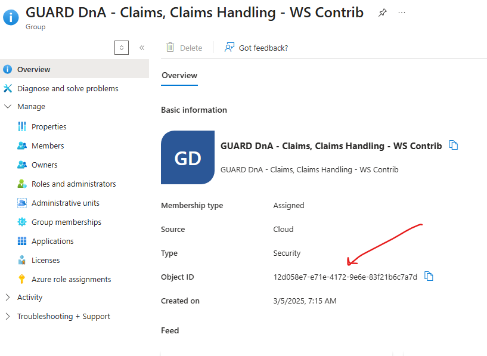

**What happens after deployment?**
Once the CI/CD pipeline completes, the contributor security group will appear in the Fabric workspace's **Manage Access** panel with the **Contributor** role. All members of the group — across the Analytics Engineer, Custodian, Data Analyst, Data Engineer, and Data Modeler roles — will have access to work within the workspace.

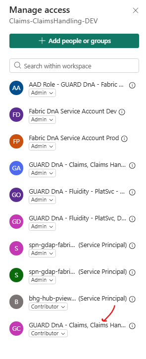

#### Service Principal Credendial

**Purpose:** This set of properties provides the service principal credentials required for CI/CD and automation tools to authenticate against Azure and provision Fabric-related infrastructure artifacts.

**What does this configuration do?**
These values identify the Azure subscription, tenant, and service principal identity that deployment automation runs under. Together, they allow pipeline tasks (including infrastructure provisioning and related operations) to authenticate securely and execute actions in the correct Azure context.

**Why is this reserved?**
This configuration is platform-managed because incorrect values can break deployment authentication across subdomains and environments. If `CLIENT_ID`, `TENANT_ID`, `SUBSCRIPTION_ID`, or the secret is invalid, pipeline jobs that rely on service principal authentication may fail.

**When is this used?**
These credentials are typically consumed by deployment scripts and infrastructure tasks during release runs. They are especially important for automation paths where service principal authentication is required instead of interactive user authentication.

**How is this property configured?**

- **Key:** `SUBSCRIPTION_ID`  
- **Value:** Azure subscription ID where deployment resources are managed.
  - Example: `54b793d9-b402-4390-9cb2-e18192123540`

- **Key:** `TENANT_ID`  
- **Value:** Microsoft Entra tenant ID that owns the service principal.
  - Example: `d9f7f9f1-c307-4884-ae62-0b13e49b2698`

- **Key:** `CLIENT_ID`  
- **Value:** Application (client) ID of the service principal application.
  - Example: `b73628a9-38e4-4020-b6be-1d616c5d3ea7` (service principal app ID for `spn-gdap-fabricpview`)

- **Key:** `CLIENT_SECRET`  
- **Value:** Secret for the service principal application.
  - Retrieve secret `spn-gdap-fabricpview-secret` from Key Vault: https://url.us.m.mimecastprotect.com/s/1az7C82K6AIW30gqs1hDTyHrLn?domain=portal.azure.com

- **Key:** `CLIENT_OBJECT_ID`  
- **Value:** Object ID of the service principal object in Microsoft Entra ID.
  - Example: `4d363d7a-921b-402b-89ee-659dc9926642`

**Security and maintenance notes:**
- Store `CLIENT_SECRET` as a secret variable and never commit it to source control.
- If authentication starts failing, validate all five values (`SUBSCRIPTION_ID`, `TENANT_ID`, `CLIENT_ID`, `CLIENT_SECRET`, `CLIENT_OBJECT_ID`) and confirm the service principal still has required permissions.

#### Service Account Credentials for FABRIC REST API
Purpose: Service account credentials to create fabric artifacs mainly for Fabric REST API.

Background: In the past Microsoft Entra supported identities for APIs creating fabric artifacts not always these identitites were supported: user, service principal and managed identities.    

- **Key:** `SERVICE_ACCOUNT_NAME`  
- **Value:** FabricDnAServiceAccountProd@guard.com

- **Key:** `SERVICE_ACCOUNT_SECRET`  
- **Value:** retrieve secret `FabricDnAServiceAccountProd-password` from key vault, https://url.us.m.mimecastprotect.com/s/1az7C82K6AIW30gqs1hDTyHrLn?domain=portal.azure.com 


#### Domain and Subdomain Workspace Settings

**Purpose:** This configuration assigns each Fabric workspace to the correct business domain hierarchy so users can discover content more easily and governance remains consistent across the platform.

**What does this configuration do?**
These properties map the workspace to:
- a **parent domain** (also referred to as the superdomain), and
- a **child domain** (the subdomain).

This mapping helps classify workspace content correctly in Fabric and ensures the workspace appears under the right domain structure.

**Why is this important?**
Domain assignment improves discoverability, ownership clarity, and governance. If domain values are incorrect, users may have difficulty finding data products, and reporting or operational ownership can become unclear.

**How is this property configured?**

- **Key:** `PARENT_DOMAIN_NAME`  
- **Value:** Parent/business domain name.
  - Example: `Claims`

- **Key:** `CHILD_DOMAIN_NAME`  
- **Value:** Subdomain name under the parent domain.
  - Example: `Claims Handling`

**How values should be set:**
- `PARENT_DOMAIN_NAME` should match the domain used by your business area.
- `CHILD_DOMAIN_NAME` should match the subdomain represented by the workspace.
- Keep naming consistent across environments (DEV/QA/UAT/PRD) to avoid domain mismatches during promotion.

**What happens after deployment?**
When the CI/CD pipeline completes, the workspace is configured with the provided parent and child domain values in Fabric workspace settings. This ensures the workspace is categorized correctly in the domain hierarchy.

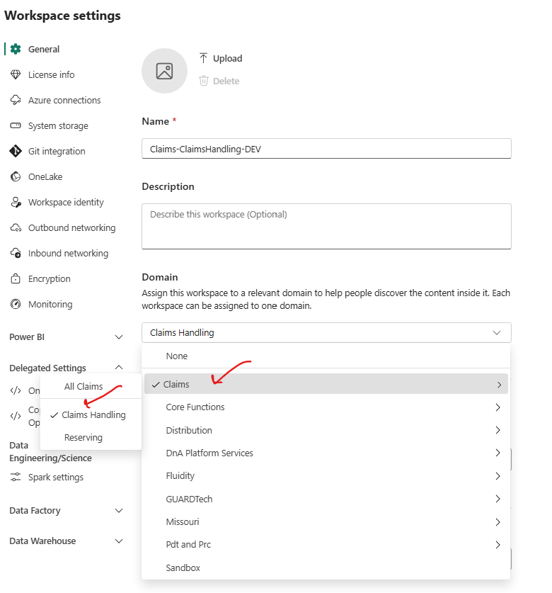

#### CI-CD Pipeline Approval
**Purpose:** This property controls which approval workflow the CI/CD pipeline must pass before deployment continues. It ensures the right stakeholders review and approve changes based on environment criticality.

**What does this configuration do?**
The pipeline reads `PIPELINE_ENVIRONMENT_APPROVAL` to decide which Azure DevOps environment approval gate to use. Each gate has a different set of approver groups aligned to platform governance and release risk.

**Why is this important?**
Approval gates prevent unauthorized or unreviewed deployments, especially in higher environments. They enforce separation of duties and ensure production releases receive broader business and technical review.

**How is this property configured?**

- **Key:** `PIPELINE_ENVIRONMENT_APPROVAL`  
- **Value:** Approval environment name used by the pipeline.
  - Example: `lifecycleManagementApproval`

**Approval models supported:**

- `lifecycleManagementApproval`
  - Used for lower environments (such as DEV, QA, UAT, PREPRD).
  - Approvers include:
    - Platform Services group: `GUARD DnA - Fluidity - PlatSvc, DevOps`
    - Data Product Architect group: `GUARD DnA - <domain-name> <subdomain-name> - Data Product Arch`
    - Data Engineer group: `GUARD DnA - <domain-name> <subdomain-name> - Data Eng`
    - Data Engineer (Consultant) group: `GUARD DnA - <domain-name> <subdomain-name> - Data Eng - Consultant`
    - Analytics Eng group: `GUARD DnA - <domain-name> <subdomain-name> - Analytics Eng`

- `featureManagementApproval`
  - Used for feature branch/subdomain feature deployments.
  - Approvers include:
    - Platform Services group: `GUARD DnA - Fluidity - PlatSvc, DevOps`
    - Data Product Architect group: `GUARD DnA - <domain-name> <subdomain-name> - Data Product Arch`
    - Data Engineer group: `GUARD DnA - <domain-name> <subdomain-name> - Data Eng`
    - Data Engineer (Consultant) group: `GUARD DnA - <domain-name> <subdomain-name> - Data Eng - Consultant`
    - Analytics Eng group: `GUARD DnA - <domain-name> <subdomain-name> - Analytics Eng`


- `productionManagementApproval`
  - Used for PRD deployments.
  - Approvers include:
    - Platform Services group: `GUARD DnA - Fluidity - PlatSvc, DevOps`
    - Data Product Manager group: `GUARD DnA - <domain-name> <subdomain-name> - Data Product Mgr`
    - Data Analyst group: `GUARD DnA - <domain-name> <subdomain-name> - Data Analyst`
    - Data Engineer group: `GUARD DnA - <domain-name> <subdomain-name> - Data Eng`

**How these approvals are created:**
Approval environments are created and maintained by the deployment process (for example through the `deploy-release-subdomain.yml` pipeline), and then referenced through `PIPELINE_ENVIRONMENT_APPROVAL` in the variable group.

**What happens during deployment?**
When the pipeline reaches the environment gate, it pauses and waits for approval from the configured approver groups. Deployment resumes only after approval is granted.

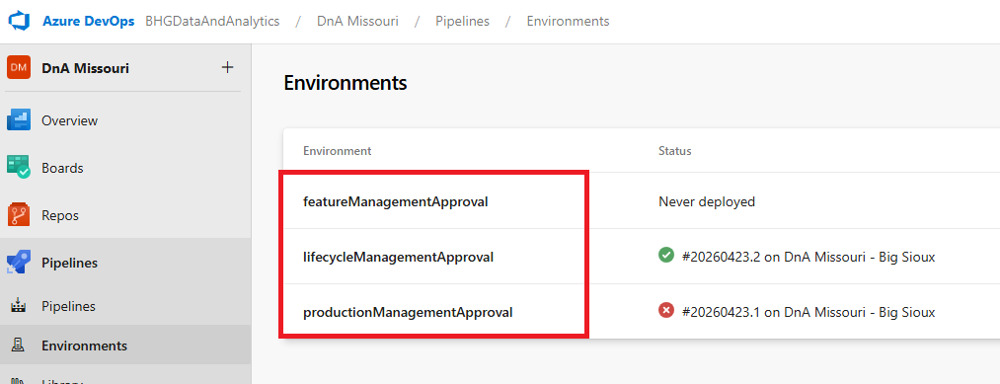

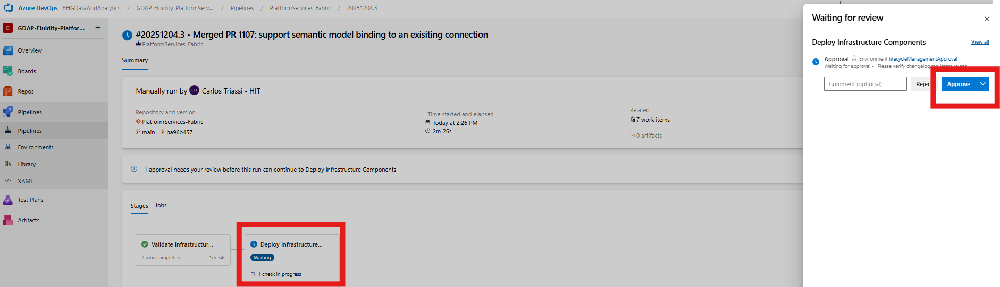

#### Workspace Creation
**Purpose:** This property defines the Fabric workspace name that the CI/CD pipeline should create (or target) for the deployment environment.

**What does this configuration do?**
During deployment, the pipeline reads the workspace name from the variable group and uses it to provision the workspace and align subsequent deployment steps (artifacts, permissions, settings, and environment mappings) to that exact workspace.

**Why is this important?**
Workspace naming drives deployment consistency across environments. If the name is incorrect, artifacts can be deployed to the wrong workspace or provisioning can fail.

**Important behavior and constraint:**
Fabric workspace names are immutable after creation. Once a workspace is created, it cannot be renamed. Any rename attempt should be treated as creating a new workspace with a new name and updating dependent configuration accordingly.

**How is this property configured?**

- **Key:** `WORKSPACE_NAMES`  
- **Value:** JSON array containing the target workspace name.

Example:
```json
["Claims-ClaimsHandling-DEV"]
```

**How values should be set:**
- Use a clear, environment-specific naming convention that matches your domain/subdomain pattern.
- Ensure the workspace name aligns with the selected variable group environment (DEV/QA/UAT/PRD).
- Keep names stable once promoted, because existing workspace names cannot be changed later.

**What happens after deployment?**
If the workspace does not exist, the pipeline creates it using the configured name and then continues applying platform settings and deploying artifacts. If it already exists, the pipeline targets that workspace for updates.

#### INT Workspace Sync with Git
**Purpose:** This configuration enables synchronization of the INT Fabric workspace content to the subdomain repository branch used for integration alignment.

**What does this configuration do?**
When enabled in the CI/CD process, the pipeline reads the target DevOps location (organization, project, and repository) and syncs the INT workspace state to the `integration_platform_services` branch. This keeps the integration branch aligned with what exists in the INT workspace.

**Why is this important?**
INT sync helps teams maintain a reliable integration baseline between Fabric workspace content and source control. Without consistent sync, workspace and Git can drift, making troubleshooting and promotion across environments harder.

**How is this property configured?**

- **Key:** `TARGET_ORGANIZATION`  
- **Value:** Azure DevOps organization name.
  - Example: `BHGDataAndAnalytics`

- **Key:** `TARGET_PROJECT`  
- **Value:** Target Azure DevOps project for the subdomain repository.
  - Example pattern: `DnA <domain-name>`
  - Example: `DnA Claims`

- **Key:** `TARGET_REPOSITORY`  
- **Value:** Target repository that receives the INT workspace sync.
  - Example pattern: `DnA <domain-name> - <subdomain-name>`
  - Example: `DnA Claims - Claims Handling`

**How values should be set:**
- `TARGET_ORGANIZATION` must match the DevOps organization where the repository is hosted.
- `TARGET_PROJECT` must point to the correct domain project.
- `TARGET_REPOSITORY` must match the exact repository name used by the subdomain.
- Keep these values aligned with the selected variable group environment to avoid syncing to the wrong repo.

**What happens during deployment?**
When the sync option is selected, the pipeline publishes INT workspace changes to the `integration_platform_services` branch in the configured target repository.


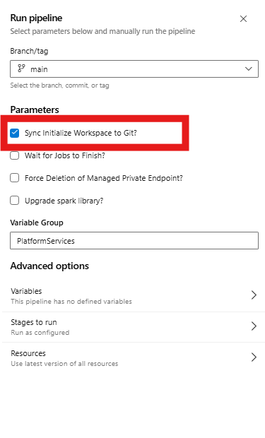

#### Teams Credentials Sending Release Notes Notification
**Purpose:** This configuration provides the credentials used to authenticate with Microsoft Teams and send automated release-notes notifications for Platform Services and subdomain deployments.

**What does this configuration do?**
The pipeline uses these credentials to obtain access tokens and post release communication to Teams on behalf of the notification account. This ensures deployment updates are communicated consistently without requiring manual messages.

**Why is this important?**
Release-note notifications improve visibility of platform and subdomain changes, help teams track deployments, and support coordinated validation across engineering and business stakeholders.

**How is this property configured?**

- **Key:** `TEAMS_CLIENT_ID`  
- **Value:** Application (client) ID for the Teams notification app registration.
  - Example: `684fdaf3-73b2-4114-92c1-3d4ca6fb0107`

- **Key:** `TEAMS_CLIENT_SECRET`  
- **Value:** Client secret for the Teams notification app registration.
  - Retrieve secret `spn-gdap-teams-notification-secret` from Key Vault: https://url.us.m.mimecastprotect.com/s/IpgfC73VLzu2MKYNF8fRTo3UZF?domain=portal.azure.com

- **Key:** `TEAMS_CLIENT_OBJECT_ID`  
- **Value:** Object ID of the Teams notification app/service principal in Microsoft Entra ID.
  - Example: `d2842783-b68d-4210-b46a-5cc559c621a2`

- **Key:** `TEAMS_NOTIFICATION_USERNAME`  
- **Value:** Service account UPN used to send Teams notifications.
  - Example: `GUARD_DnA_Teams_Notification@guard.com`

- **Key:** `TEAMS_NOTIFICATION_PASSWORD `  
- **Value:** Password for the notification service account.
  - Retrieve secret `GUARDDnATeamsNotification-ServiceAccount-password` from Key Vault: https://url.us.m.mimecastprotect.com/s/IpgfC73VLzu2MKYNF8fRTo3UZF?domain=portal.azure.com

**Security and maintenance notes:**
- Store `TEAMS_CLIENT_SECRET` and `TEAMS_NOTIFICATION_PASSWORD` as secret variables only.
- Do not expose these values in logs, scripts, or source control.
- If Teams notification fails, validate all credential values and confirm the app registration and service account are still active.

**What happens during deployment?**
When release notes are generated, the pipeline authenticates with these credentials and posts notifications to the configured Teams destination so stakeholders receive deployment updates automatically.

#### How Notifications Are Sent by Create Release Pipeline
**Purpose:** This section explains how the create-release pipelines use variable-group values to send release notes notifications to Microsoft Teams.

**Which pipelines support this?**
- `DevOpsServices/pipelines/release/create-release-branch.yml`
- `DevOpsServices/pipelines/release/create-subdomain-release-branch.yml`

Both pipelines include a runtime parameter:
- `sendTeamsNotification` (default: `false`)

Teams notifications are only sent when `sendTeamsNotification` is set to `true`.

**How the notification flow works:**
1. The pipeline loads the selected variable group.
2. It passes Teams-related values into the release script, including `TEAMS_CLIENT_ID`, `TEAMS_CLIENT_SECRET`, `TEAMS_NOTIFICATION_USERNAME`, `TEAMS_NOTIFICATION_PASSWORD`, `TEAMS_CHANNEL_WEB_URL`, and `TEAMS_TAGS`.
3. The release script creates the release branch and generates `changelog.md` from completed pull requests and linked work items.
4. If `sendTeamsNotification = true`, the script requests a Microsoft Graph token and resolves Team and Channel IDs from `TEAMS_CHANNEL_WEB_URL`.
5. The script formats release notes and posts the message to the configured Teams channel.
6. If `sendTeamsNotification = false`, branch and changelog creation still complete, but no Teams message is posted.

**What is used inside the release script?**
- Script: `DevOpsServices/pipelines/scripts/Create-ReleaseBranch.ps1`
- Token function: `Get-TeamsToken`
- Channel parser: `Get-TeamsChannelInfo`
- Message sender: `Send-TeamsChannelMessage`

**Deployment outcome:**
When enabled, each create-release run can automatically publish release notes to Teams and mention configured audience tags from `TEAMS_TAGS`, so stakeholders are notified as part of the same release workflow.

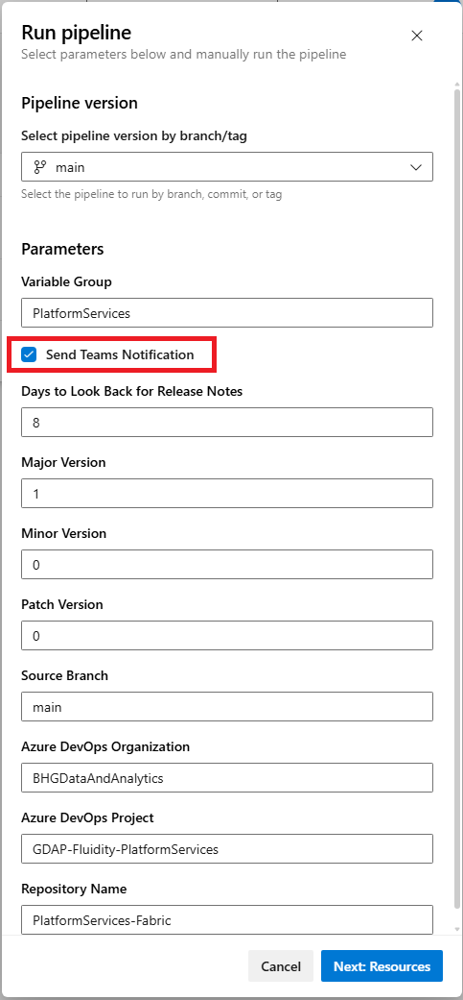


## Reserved Domain Variable Group Properties

Domain properties are reserved configuration values that are intended to be maintained by domain teams for their own environments. Unlike Platform Services reserved properties, these values are designed to be adaptable at the domain/subdomain level to support business-specific workspace behavior, connections, and data product requirements.

**Why are these properties reserved?**
These properties control deployment behavior that is still critical to platform operation, but the correct values can vary by domain, subdomain, and environment. They are treated as reserved to ensure teams understand their operational impact and manage them intentionally.

**Who manages Domain properties?**
These properties may be changed by the **Data Product Architect** (and authorized domain engineering teams) to align with domain-specific needs such as workspace capacity, key vault mapping, network endpoints, semantic model connections, and pipeline connection remapping.

**What happens if they are modified?**
If modified correctly, these values are **not overwritten** during the next Platform Services release deployment. This allows each domain to preserve its own approved environment-specific configuration across future platform releases.

**What should be reviewed before changing them?**
Before updating domain reserved properties, confirm the change aligns with target environment requirements (DEV/QA/UAT/PRD), dependency mappings, and governance approvals. Incorrect values can cause deployment drift, failed artifact configuration, or broken downstream connectivity.

The subsections below describe each reserved domain property group, its purpose, and expected configuration pattern.

#### Fabric Capacity Configuration
**Purpose:** This property identifies the Microsoft Fabric capacity that should be associated with a workspace for the target environment.

**What does this configuration do?**
The deployment process uses `CAPACITY_ID` to determine which Fabric capacity the workspace should use. Capacity is domain-level infrastructure and is typically shared by subdomains within that domain.

**Why is this important?**
Capacity assignment affects performance, workload isolation, and cost governance. If the wrong capacity is referenced, workloads may run in an unintended environment or with incorrect compute resources.

**Important behavior and constraint:**
- Capacity is assigned when a workspace is created.
- Existing workspace capacity is not automatically changed by routine CI/CD deployment runs.
- If you need to move an existing workspace to a different capacity, perform that change manually or through an approved script/process.

**How is this property configured?**

- **Key:** `CAPACITY_ID`  
- **Value:** Fabric capacity ID (GUID) for the target environment.
  - Example: `7CEEEC90-3EDE-4120-93CD-7D96FB60EE65`

**How values should be set:**
- Use the correct capacity ID for each environment (DEV/QA/UAT/PRD).
- Keep non-production and production mappings clearly separated.
- PRD can use a different capacity from lower environments based on workload and governance requirements.

**What happens after deployment?**
After deployment or workspace provisioning, validate the workspace `License info` settings to confirm the expected capacity ID is applied.

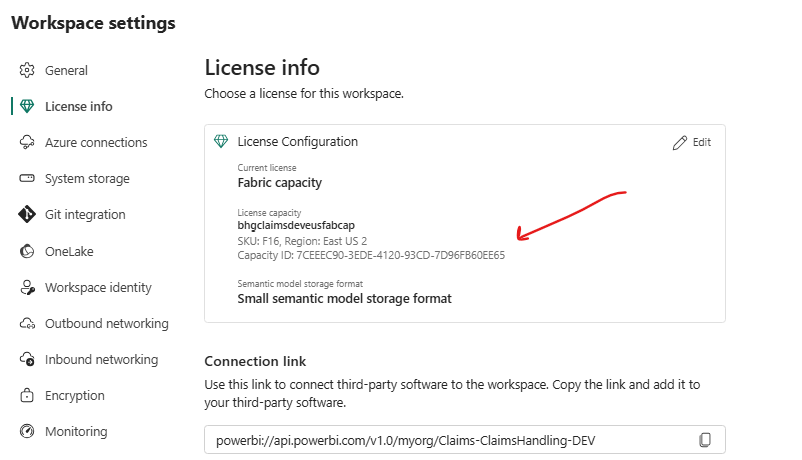

#### Notebook Key Vault Name Replacement
**Purpose:** This property provides the Key Vault name that CI/CD injects into notebook code so deployed notebooks use the correct environment-specific secret scope.

**What does this configuration do?**
The deployment pipeline scans the notebook content for a specific assignment pattern (`secretScope =`) and replaces the value with the Key Vault name from the variable group. This allows the same notebook codebase to work across DEV, QA, UAT, and PRD without manual edits in source control.

This replacement is applied to the Platform Services-provided parameter notebook `den_nbk_pdi_001_workspace_parameters`, which defines the `secretScope` value used by dependent notebooks.
During CI/CD deployment, the pipeline replaces this `secretScope` value with the environment-specific Key Vault name from `KEYVAULT_NAME`, so notebooks resolve secrets from the correct target environment.

**Why is this important?**
Notebook workloads often depend on secrets (for example connection strings, API keys, and credentials). If the Key Vault reference is wrong, notebook execution may fail or read from an unintended environment.

**Important behavior and constraint:**
- The replacement depends on finding the exact pattern `secretScope =`.
- Do not rename or remove this pattern in the notebook template logic.
- If the pattern changes, the pipeline cannot reliably inject the target Key Vault value.

**How is this property configured?**

- **Key:** `KEYVAULT_NAME`  
- **Value:** Key Vault name for the target environment.
  - Example: `bhg-dev-claimshdl-eus-kv`

**How values should be set:**
- Set `KEYVAULT_NAME` to the Key Vault associated with the same environment as the selected variable group.
- Keep naming aligned with environment promotion (DEV to QA to UAT to PRD).
- Validate that the referenced Key Vault exists and contains the required secrets.

**What happens after deployment?**
When deployment runs, notebooks are updated with the target Key Vault scope value, and subsequent notebook execution resolves secrets from the correct environment-specific Key Vault.

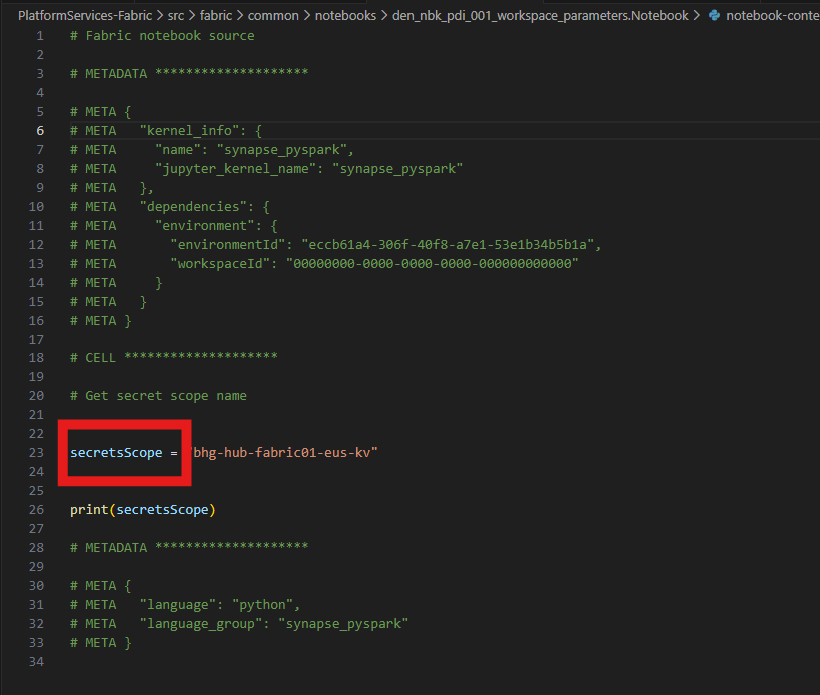

#### Teams Channel Link and Teams Tags
**Purpose:** These properties define where release-note notifications are posted in Microsoft Teams and which audience groups should be tagged in those messages.

**What does this configuration do?**
The pipeline uses the Teams channel URL to resolve the target Team and Channel, then sends formatted release updates to that location. It also reads configured Teams tags so notifications can mention the right business and engineering audiences.

**Why is this important?**
Consistent channel routing and tag mentions improve release visibility, reduce missed communications, and ensure the right stakeholders are alerted for platform and subdomain changes.

**Channel ownership and setup expectation:**
- The Data Product Manager should create and maintain an appropriate public Guard Teams channel for release communications.
- The selected channel should be accessible to intended recipients.
- Required tags must be created in that channel before pipeline notifications are sent.

**How is this property configured?**

- **Key:** `TEAMS_CHANNEL_WEB_URL`  
- **Value:** Teams channel web URL used by CI/CD to post release notifications.
  - Example: https://teams.microsoft.com/l/channel/19%3A9b5fd59639ef443097b95e1e51c5f050%40thread.tacv2/Platform%20Services%20-%20DevOps%20Release%20Notes?groupId=8f3ce823-54d1-4cb2-986a-ccbfdad9d9c2&tenantId=d9f7f9f1-c307-4884-ae62-0b13e49b2698

  - View to acquire Teams channel link.

  
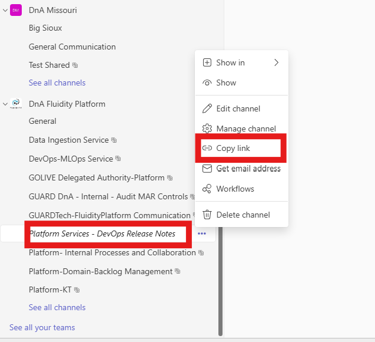

- **Key:** `TEAMS_TAGS`  
- **Value:** Comma-separated list of tag names to mention in Teams notifications.
  - Example: `Executive, Data Product Manager, Domain Scrum Master, Data Product Architect, Internal Audit/MARS, DnA Leadership`

**How values should be set:**
- Set `TEAMS_CHANNEL_WEB_URL` to the exact channel intended for release notes.
- Use tag names in `TEAMS_TAGS` that already exist in the target Teams channel.
- Keep tag naming consistent across environments where the same audience should be notified.

**What happens during deployment?**
When notification is enabled in create-release pipelines, CI/CD posts the release message to `TEAMS_CHANNEL_WEB_URL` and attempts to mention matching tags from `TEAMS_TAGS` so the configured audience is notified automatically.

#### Spark Compute Configuration
**Purpose:** This configuration defines the Spark compute profile used by notebooks and Spark job definitions in each environment (DEV/QA/UAT/PREPRD/PRD).

**What does this configuration do?**
These properties control driver and executor sizing, autoscaling boundaries, and runtime version so Spark workloads execute with a predictable compute profile during deployment and runtime.

**Why is this important?**
Correct Spark sizing helps balance performance, stability, and cost. If these values are too low, jobs may fail or run slowly; if too high, compute usage can become unnecessarily expensive.

**How is this property configured?**

- **Key:** `sparkCompute.driver_cores`  
- **Value:** Number of CPU cores assigned to the Spark driver.
  - Example: `4`

- **Key:** `sparkCompute.driver_memory`  
- **Value:** Memory allocated to the Spark driver.
  - Example: `28g`

- **Key:** `sparkCompute.executor_cores`  
- **Value:** Number of CPU cores assigned per executor.
  - Example: `1`

- **Key:** `sparkCompute.executor_memory`  
- **Value:** Memory allocated per executor.
  - Example: `28g`

- **Key:** `sparkCompute.max_executors`  
- **Value:** Maximum number of executors allowed for the workload.
  - Example: `1`

- **Key:** `sparkCompute.min_executors`  
- **Value:** Minimum number of executors maintained for the workload.
  - Example: `1`

- **Key:** `sparkCompute.runtime_version`  
- **Value:** Spark runtime version used by the environment.
  - Example: `1.3`

**How values should be set:**
- Keep these values aligned with workload size and SLA expectations for each environment.
- Use conservative sizing in lower environments and production-appropriate sizing in PRD.
- Validate runtime compatibility when changing `sparkCompute.runtime_version`.

**What happens during deployment?**
CI/CD applies this Spark compute configuration so deployed notebooks and Spark jobs run with the defined driver/executor profile and runtime version.

  - View of spark environment compute after CI/CD pipeline runs.

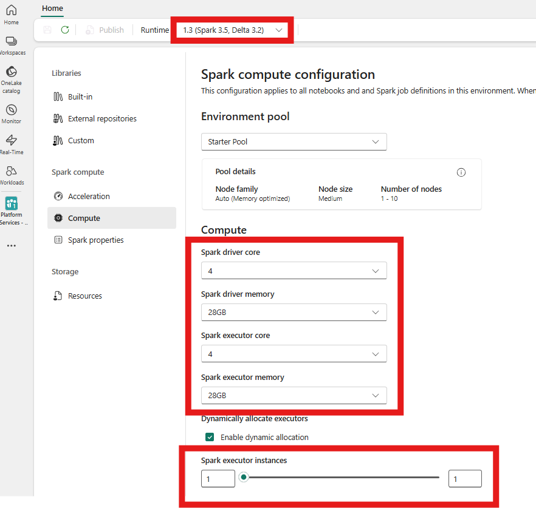

#### Managed Private Endpoints for Blob Storage
**Purpose:** This configuration controls creation and approval of managed private endpoints from Fabric to Azure Blob Storage for the target environment.

**What does this configuration do?**
These properties tell CI/CD whether a Blob private endpoint should be enforced, which storage account resource to target, and which subresource type to use. The private endpoint naming pattern follows:

`<domain>-<subdomain>-<DEV/QA/UAT/PRD>-<storage-account-name>`

**Why is this important?**
Private endpoints secure data access by routing traffic privately instead of over public paths. This helps meet network security requirements and reduces exposure of storage connectivity.

**Important behavior and constraint:**
- CI/CD enforces creation and approval when enabled.
- CI/CD does not automatically remove existing private endpoints.
- Any endpoint removal must be done manually in Fabric Workspace Settings -> Outbound Networking.

**How is this property configured?**

- **Key:** `pep.blob.allowed`  
- **Value:** Enables or skips Blob private endpoint enforcement.
  - `true`: Enforces creation and approval of the storage account private endpoint.
  - `false`: Skips private endpoint creation and approval.

- **Key:** `pep.blob.resourceId`  
- **Value:** Azure Resource ID of the target storage account.
  - Example: `/subscriptions/54b793d9-b402-4390-9cb2-e18192123540/resourceGroups/bhg-prod-fabric-eus-rg/providers/Microsoft.Storage/storageAccounts/bhgprodfabricedoussa`

- **Key:** `pep.blob.subresourceType`  
- **Value:** Blob subresource type for the endpoint configuration.
  - Example: `blob`

**How values should be set:**
- Set `pep.blob.allowed` based on whether the environment requires private Blob connectivity.
- Provide the exact storage account `pep.blob.resourceId` for the target environment.
- Keep `pep.blob.subresourceType` as `blob` for Azure Storage Blob endpoints.

**What happens during deployment?**
If enabled, CI/CD creates and approves the Blob managed private endpoint for the configured storage account so workspace outbound access can use private networking.

  - View workspace settings outbound networking for private endpoint storage account.

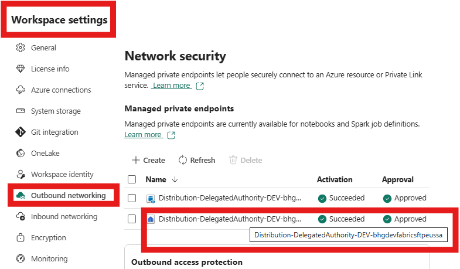

#### Managed Private Endpoints for Key Vault
**Purpose:** This configuration controls creation and approval of managed private endpoints from Fabric to Azure Key Vault for the target environment.

**What does this configuration do?**
These properties tell CI/CD whether a Key Vault private endpoint should be enforced, which Key Vault resource to target, and which subresource type to use. The private endpoint naming pattern follows:

`<domain>-<subdomain>-<DEV/QA/UAT/PRD>-<key-vault-name>`

**Why is this important?**
Private endpoints protect secrets access by keeping Key Vault connectivity on private networking paths. This improves security posture and helps satisfy environment network controls.

**Important behavior and constraint:**
- CI/CD enforces creation and approval when enabled.
- CI/CD does not automatically remove existing private endpoints.
- Any endpoint removal must be done manually in Fabric Workspace Settings -> Outbound Networking.

**How is this property configured?**

- **Key:** `pep.vault.allowed`  
- **Value:** Enables or skips Key Vault private endpoint enforcement.
  - `true`: Enforces creation and approval of the Key Vault private endpoint.
  - `false`: Skips private endpoint creation and approval.

- **Key:** `pep.vault.resourceId`  
- **Value:** Azure Resource ID of the target Key Vault.
  - Example: `/subscriptions/3a2539e2-7efe-40cb-b451-10953168fd56/resourceGroups/bhg-hub-fabric-eus-rg/providers/Microsoft.KeyVault/vaults/bhg-hub-fabric01-eus-kv`

- **Key:** `pep.vault.subresourceType`  
- **Value:** Key Vault subresource type used by the endpoint configuration.
  - Example: `vault`

**How values should be set:**
- Set `pep.vault.allowed` based on whether the environment requires private Key Vault connectivity.
- Provide the exact Key Vault `pep.vault.resourceId` for the target environment.
- Keep `pep.vault.subresourceType` as `vault` for Azure Key Vault endpoints.

**What happens during deployment?**
If enabled, CI/CD creates and approves the Key Vault managed private endpoint for the configured Key Vault so workspace outbound secret access can use private networking.

  - View workspace settings outbound networking for private endpoint key vault.

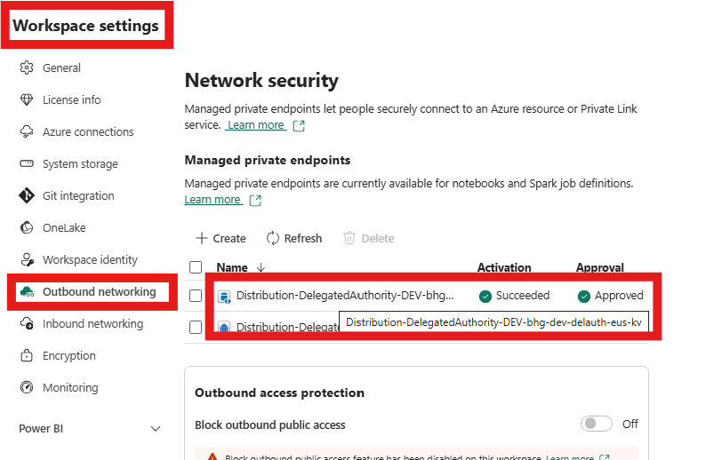

#### Remote Shortcut Lakehouse Configuration
**Purpose:** This configuration enables CI/CD to resolve and create remote OneLake lakehouse shortcuts by supplying target workspace and lakehouse names through variable-group values.

**What does this configuration do?**
When shortcut metadata does not contain target IDs (`workspaceId` and `itemId`) or when those values differ by environment, the pipeline uses variable-group keys to determine the remote target workspace and lakehouse for each shortcut name.

**Why is this important?**
Without explicit mapping, shortcut creation can fail or point to the wrong data source. Environment-specific mapping ensures shortcuts resolve correctly after deployment and keeps DEV/QA/UAT/PRD behavior consistent.

**Naming pattern for keys:**
Use the shortcut name from `shortcut.metadata.json` in these keys:
- `shortcut.<shortcutname>.workspace`
- `shortcut.<shortcutname>.lakehouse`

**How is this property configured?**

- **Key:** `shortcut.shortcutname.workspace`  
- **Value:** Name of the remote workspace that hosts the target lakehouse.
  - Example format: `<workspace-name>`

- **Key:** `shortcut.shortcutname.lakehouse`  
- **Value:** Name of the target remote lakehouse.
  - Example format: `<lakehouse-name>`

Given a lakehouse shortcut.metadata.json file
  ```json
[
  {
    "name": "dim_date_trans_date",
    "path": "/Tables/claims_transaction",
    "target": {
      "type": "OneLake",
      "oneLake": {
        "path": "Tables/claims_transaction/dim_date",
        "itemId": "00000000-0000-0000-0000-000000000000",
        "workspaceId": "00000000-0000-0000-0000-000000000000"
      }
    }
  },
  {
    "name": "dim_date_loss_date",
    "path": "/Tables/claims_transaction",
    "target": {
      "type": "OneLake",
      "oneLake": {
        "path": "Tables/claims_transaction/dim_date",
        "itemId": "00000000-0000-0000-0000-000000000000",
        "workspaceId": "00000000-0000-0000-0000-000000000000"
      }
    }
  }
]
```

**Why variable-group mapping is required:**
Accessing a remote target lakehouse shortcut from another workspace requires explicit target mapping when `workspaceId` and `itemId` fields in `shortcut.metadata.json` are empty or not environment-ready. The variable group provides this mapping.

- **Key:** `shortcut.dim_date_trans_date.workspace` 
- **Value:** Claims-ClaimsHandling-DEV

- **Key:** `shortcut.dim_date_trans_date.lakehouse`  
- **Value:** den_lhw_dpr_001_claims_transaction

- **Key:** `shortcut.dim_date_loss_date.workspace`  
- **Value:** Claims-ClaimsHandling-DEV

- **Key:** `shortcut.dim_date_loss_date.lakehouse`  
- **Value:** den_lhw_dpr_001_claims_transaction

**How values should be set:**
- Use exact shortcut names from `shortcut.metadata.json` in the variable-group key names.
- Set workspace and lakehouse values for the correct target environment.
- Keep names synchronized with actual Fabric workspace and lakehouse display names.

**What happens during deployment?**
During CI/CD, shortcut definitions are updated/resolved using these mappings so deployed shortcuts in the current workspace can access the intended remote lakehouse in the mapped workspace.

#### Lakehouse OneLake Security Default Roles
**Purpose:** This configuration controls how default OneLake data-access roles are managed for a lakehouse by assigning approved reader members to the built-in `DefaultReader` role during CI/CD deployment.

**What does this configuration do?**
During deployment, the role-management script `DevOpsServices/pipelines/scripts/Update-OneLakeDataAccessRoles.ps1`:
- Locates the target lakehouse by `workspaceId` and `lakehouseName`.
- Enables OneLake security for that lakehouse.
- Reads configured default-reader member mappings from environment variables.
- Retrieves existing lakehouse data access roles and updates `DefaultReader` members.

**Why is this important?**
Without centralized role mapping, feature or environment deployments can leave lakehouse access inconsistent across DEV/QA/UAT/PRD. Managing `DefaultReader` membership through variable-group-driven configuration ensures consistent least-privilege read access and reduces manual access drift.

**Important behavior and constraint:**
- The script targets the `DefaultReader` role only.
- OneLake security is explicitly enabled before role update.
- Member entries are merged without duplicates.
- If no matching lakehouse is found or `DefaultReader` role is missing, deployment fails.
- If no configured members are found for the target lakehouse, the script exits without role changes.

**How is this property configured?**

Use paired variable keys for each lakehouse mapping entry:

- **Key:** `lakeHouse.defaultReaders.lakehouse_<n>.name`  
- **Value:** Target lakehouse display name.

- **Key:** `lakeHouse.defaultReaders.lakehouse_<n>.readerMembers`  
- **Value:** Comma-separated Microsoft Entra object IDs (users/service accounts) to be assigned to `DefaultReader`.

Example:

- **Key:** `lakeHouse.defaultReaders.lakehouse_1.name`  
- **Value:** `den_lhw_dpr_001_claims_transaction`

- **Key:** `lakeHouse.defaultReaders.lakehouse_1.readerMembers`  
- **Value:** `9ae753f6-2187-4d2d-8635-5020d1536095,a36522af-54ca-4d65-a8f3-3f7c27e40917`

**How values should be set:**
- Use exact lakehouse display names for `..._NAME` values.
- Provide valid object IDs in `..._READERMEMBERS` (comma-separated, no extra quotes).
- Keep numbering pairs aligned (for example `_1_NAME` must pair with `_1_READERMEMBERS`).
- Add one numbered pair per lakehouse that needs default-reader assignment.


**What happens during deployment?**
If configuration is valid, CI/CD enables OneLake security on the target lakehouse and updates `DefaultReader` role membership with configured members for that lakehouse. Existing members are retained, new members are appended, and duplicates are avoided.

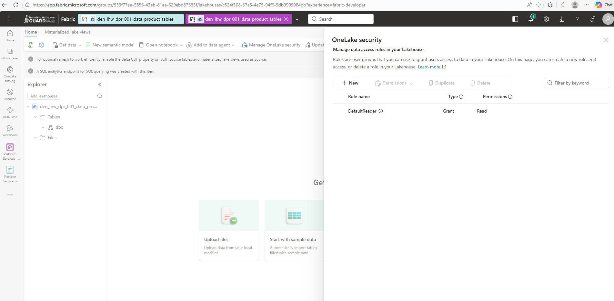

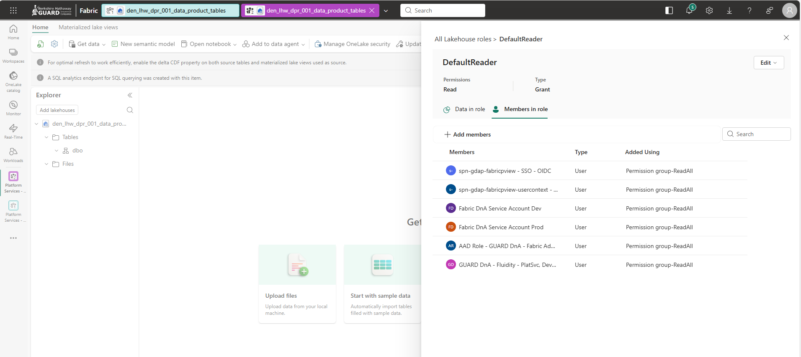

#### Semantic Model Assign SQL Endpoint Id
**Purpose:** This configuration ensures Direct-Lake semantic models are deployed with the correct environment-specific SQL endpoint reference by updating `Sql.Database(...)` expressions in semantic model `.tmdl` definitions.

**What does this configuration do?**
During CI/CD deployment, semantic model files are scanned for SQL database expressions and rewritten so both the SQL host portion and endpoint identifier align with the target environment lakehouse.

**Why is this important?**
Feature-branch development often introduces DEV-specific SQL endpoint values into source control. If these values are promoted unchanged, higher environments (QA/UAT/PRD) may point to incorrect lakehouse endpoints, causing model refresh failures or incorrect data access.

**Expression pattern scanned by CI/CD:**

`Sql.Database("<sql-connection-string>.datawarehouse.fabric.microsoft.com", "<any-guid-value>")`

**How replacement works:**
The pipeline resolves the semantic-model-specific variable key pattern `sm.<semanticmodel>.newValue` and uses it to inject the correct target lakehouse reference. This replacement updates the SQL connection expression so it is environment-aligned at deployment time.

**How is this property configured?**

- **Key:** `sm.semanticmodelname.newValue`  
- **Value:** `<lakehouse-name>`

Example: Given the semantic model `pbi_dst_001_claims_transactions`, the database query initially appears as:

expression DatabaseQuery =
    let
        database = Sql.Database("6H47PWIHYOCERLTCBMJ6JGZGTA-2BPU5FY3CW4E7MFDDKKZCBMJXE.datawarehouse.fabric.microsoft.com", "ffcbf3a6-7eb8-4518-a52e-7b3c87a975ed")
    in
        database
lineageTag: 547eba57-d5fb-4e01-aac1-d3cee366d4b6


The following changes are required to replace the current lakehouse name in the database query with its correct SQL endpoint ID:

- **Key:** `sm.pbi_dst_001_claims_transactions.newValue`  
- **Value:** `den_lhw_dpr_001_claims_transaction`

**How values should be set:**
- Create one `sm.<semanticmodel>.newValue` entry per semantic model that requires SQL endpoint reassignment.
- Ensure `<semanticmodel>` exactly matches the deployed semantic model name pattern used by the pipeline.
- Set the value to the lakehouse/SQL endpoint reference valid for the target environment.

**What happens during deployment?**
When CI/CD deploys semantic models, it rewrites matching `Sql.Database(...)` expressions in `.tmdl` content with the environment-specific value from the variable group. This keeps semantic model SQL endpoint bindings consistent across DEV/QA/UAT/PRD promotions.

  - View of original database query in expressions.tmdl file, to replace SQL connection string and SQL endpoint ID.

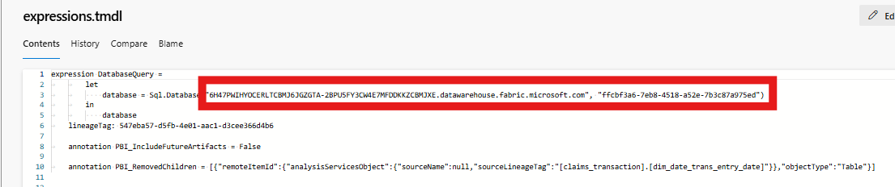

#### Semantic Model Re-Map SQL Connection
**Purpose:** This configuration allows semantic models to re-map their data source from default single-sign-on to an explicit cloud SQL connection name defined per environment.

**What does this configuration do?**
During CI/CD deployment, semantic model data source bindings are remapped to the configured connection name so each environment uses its intended SQL/cloud connection.

**Why is this important?**
Feature branches often contain DEV-oriented connection bindings. Without remapping, promoted models can reference incorrect connections in QA/UAT/PRD, causing refresh failures or incorrect data-source routing.

**When is this used?**
Use this for semantic models that must bind to a specific named connection in the target Fabric workspace during deployment.

**How is this property configured?**

- **Key:** `sm.semanticmodelname.connectionName`  
- **Value:** `<connection-name>`

**Example configuration:**

For the semantic model `pbi_dst_pdq_001_dq_dataquality`, the variable group should be configured as:

- **Key:** `sm.pbi_dst_pdq_001_dq_dataquality.connectionName`  
- **Value:** `DQ_DEV_03`

**How values should be set:**
- Create one `sm.<semanticmodel>.connectionName` entry per semantic model that requires connection remapping.
- Set the value to the exact connection name available in the target workspace for that environment.
- Keep connection names synchronized with workspace connection naming conventions (DEV/QA/UAT/PRD).
- Verify the referenced connection is created and accessible in the target Fabric workspace before deployment.

**What happens during deployment?**
When CI/CD deploys semantic models, it updates the model's data source binding to use the specified connection name. The model then connects to the target SQL database via that connection during deployment and subsequent refresh operations.

  - View of semantic model gateway cloud connections after CI/CD pipeline run to re-map a data connection.
  ```
  ``` 
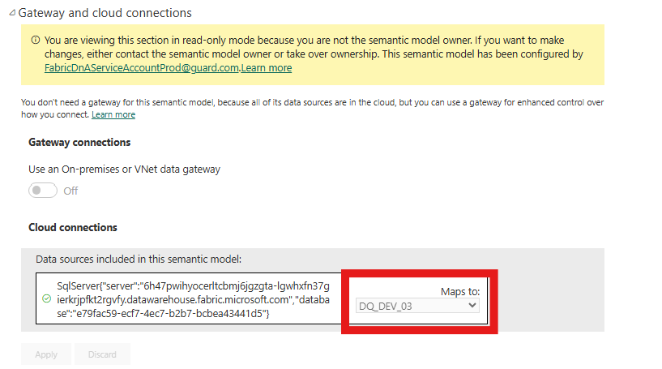

#### Semantic Model Map SQL Connection-Import mode
**Purpose:** This configuration enables Import mode semantic models to resolve environment-specific SQL endpoint and database values during deployment by replacing shared parameter expressions.

**What does this configuration do?**
For Import mode models, CI/CD updates the `SqlServer` and `Database` parameter expressions in `expressions.tmdl` so partition queries that call `Sql.Database(SqlServer, Database)` point to the correct target environment.

**Why is this important?**
Source-controlled semantic models often contain developer or lower-environment values. Without parameter remapping, Import partitions may connect to the wrong SQL endpoint/database after promotion, causing refresh failures or incorrect data retrieval.

**How is this property configured?**

Configuration keys (variable group):

- **Key:** `sm.<semanticmodel>.connectionName`  
- **Value:** `<connection-name>`

- **Key:** `sm.<semanticmodel>.newValue`  
- **Value:** `<lakehouse-or-connection-name>`

**Implementation details:**

1. Ensure `definition/expressions.tmdl` defines two parameter expressions:

  - `SqlServer` — parameter query (Text) for the Fabric SQL endpoint host
  - `Database` — parameter query (Any/Text) for the lakehouse/database name
  
  (Example)

  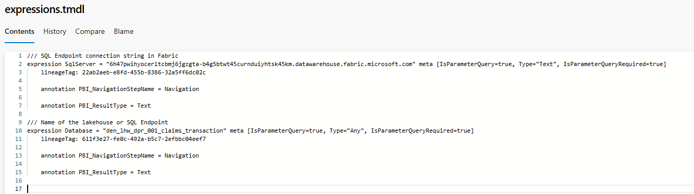

2. Confirm import partitions in `definition/tables/*.tmdl` use `mode: import`
  and set their `Source` using the parameters, for example:

```
Source =
   let
      Source = Sql.Database(SqlServer, Database),
      MyTable = Source{[Schema="claims_report",Item="staffing_model_new_claims_view"]}[Data]
   in
      MyTable
```

  (Example)

  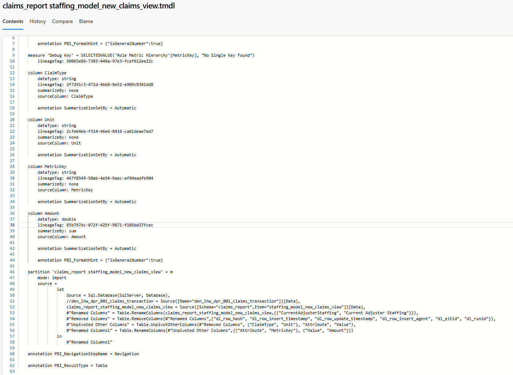

  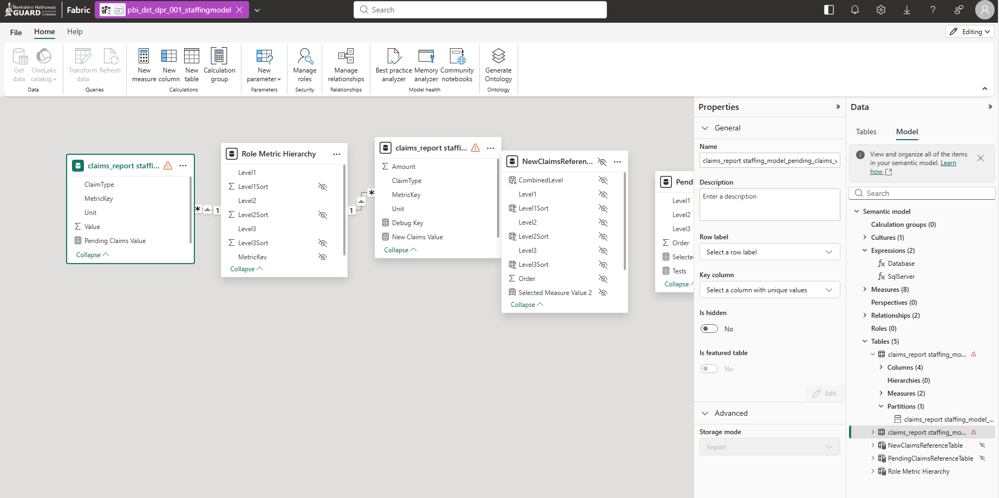

3. Configure the variable group for the target environment with the same
  naming pattern used elsewhere so CI/CD can replace the parameter values:

  - `sm.<semanticmodel>.connectionName = <connection-name>`
  - `sm.<semanticmodel>.newValue = <lakehouse-or-connection-name>`

**Example configuration (for `pbi_dst_dpr_001_staffingmodel`):**

- **Key:** `sm.pbi_dst_dpr_001_staffingmodel.connectionName`  
- **Value:** `ClaimsHandling_ClaimsTransaction_QA`  

- **Key:** `sm.pbi_dst_dpr_001_staffingmodel.newValue`  
- **Value:** `den_lhw_dpr_001_claims_transaction`

  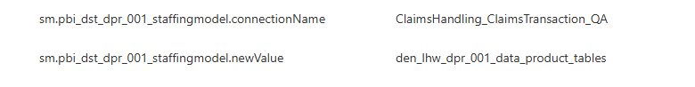

- View of semantic model gateway cloud connections afer CI/CD pipeline run to re-map a data connection.

  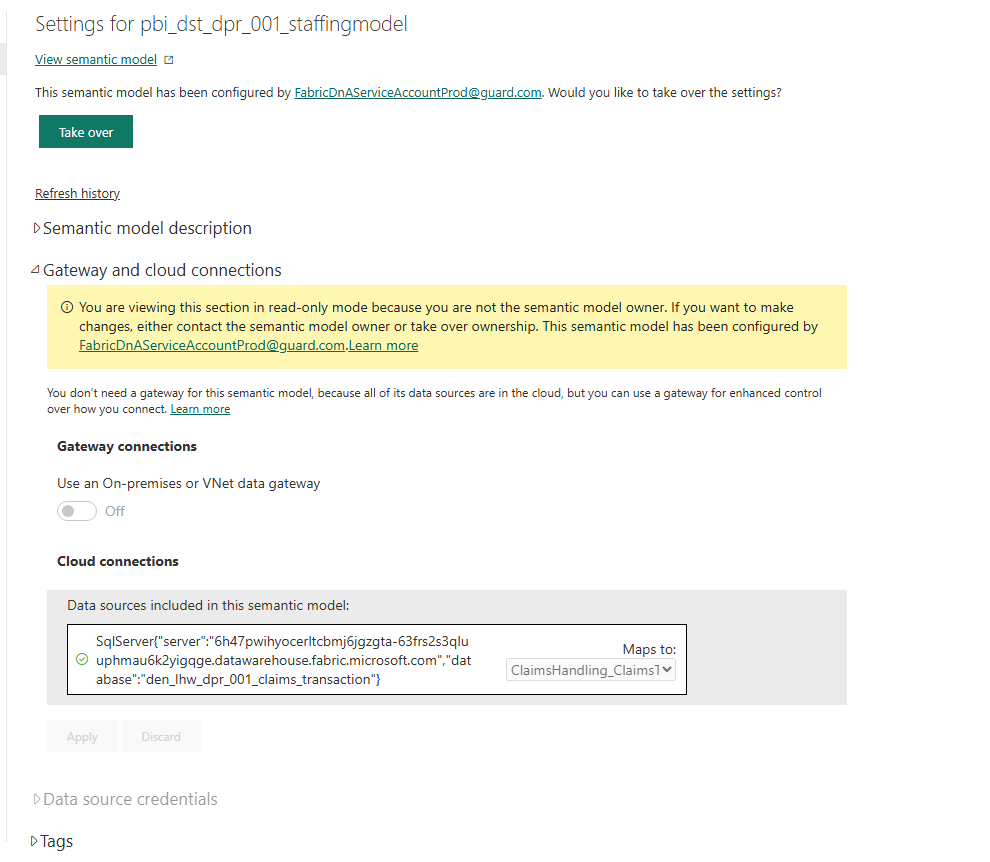

**How values should be set:**
- Create both keys for each import semantic model: `sm.<semanticmodel>.connectionName` and `sm.<semanticmodel>.newValue`.
- Ensure `<semanticmodel>` matches the deployed semantic model naming used by CI/CD.
- Set values to connection and lakehouse/database identifiers that exist in the target environment.

**What happens during deployment?**
CI/CD replaces `SqlServer` and `Database` parameter values in `expressions.tmdl`, then deploys the semantic model so Import partitions execute with environment-aligned SQL endpoint/database bindings.

**Notes:**
- Partitions must have `mode: import` and their `Source` expressions must use
  the `SqlServer` and `Database` parameters.
- The CI/CD pipeline should replace `SqlServer` and `Database` values in
  `expressions.tmdl` using the `sm.<semanticmodel>.connectionName` and
  `sm.<semanticmodel>.newValue` variable group keys during deployment.

#### Semantic Model Map Gateway Based-OneLake Connection-Direct lake
**Purpose:** This configuration enables Direct Lake semantic models to update OneLake endpoint references in `expressions.tmdl` so they point to the correct target workspace and lakehouse IDs during deployment.

**What does this configuration do?**
For Direct Lake models, CI/CD scans `expressions.tmdl` for `AzureStorage.DataLake(...)` URLs and replaces:
- Source workspace ID with the target deployment workspace ID.
- Source lakehouse ID with the target lakehouse ID resolved from variable-group mapping.

This behavior is implemented in `DevOpsServices/pipelines/scripts/Deploy-FabricSemanticModels.ps1`, method `Update-ParameterAzureStorage`.

**Why is this important?**
Feature branch models often contain DEV workspace/lakehouse IDs hardcoded in Direct Lake expressions. Without replacement, promoted deployments can continue pointing to incorrect OneLake locations, leading to wrong data access or refresh failures.

**How is this property configured?**

Configuration key (variable group):

- **Key:** `sm.<semanticmodel>.newValue`  
- **Value:** `<target-lakehouse-display-name>`

The script uses this mapping to find the lakehouse in the target workspace and get its lakehouse ID for replacement.

**Implementation details:**

1. `Update-ParameterAzureStorage` scans `.tmdl` content using pattern:

`onelake.dfs.fabric.microsoft.com/<workspace-guid>/<lakehouse-guid>`

2. It identifies the current semantic model by `DisplayName` and resolves the mapped lakehouse name from `SemanticModelsDetail` (`newValue`).

3. It looks up the target lakehouse from workspace metadata (`$global:WorkspaceLakehouses`) using that display name.

4. It replaces both GUIDs in the detected `AzureStorage.DataLake` URL:
  - workspace GUID -> current target workspace ID
  - lakehouse GUID -> resolved target lakehouse ID

**Example from `expressions.tmdl`:**

From `src/fabric/pbi_dst_001_metadata_pii_columns.SemanticModel/definition/expressions.tmdl`:

```tmdl
expression 'DirectLake - den_lhw_pdi_001_observability' =
		let
		    Source = AzureStorage.DataLake("https://onelake.dfs.fabric.microsoft.com/bc0e4841-d1ff-4d07-86bb-f9af6eeb4bba/ef7168cb-e832-4c05-865b-b44ba342e86d", [HierarchicalNavigation=true])
		in
		    Source
```


  (Example)
  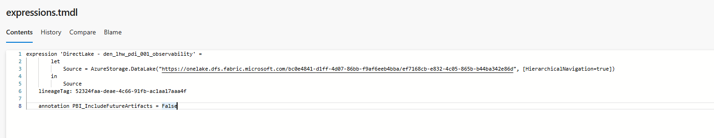

  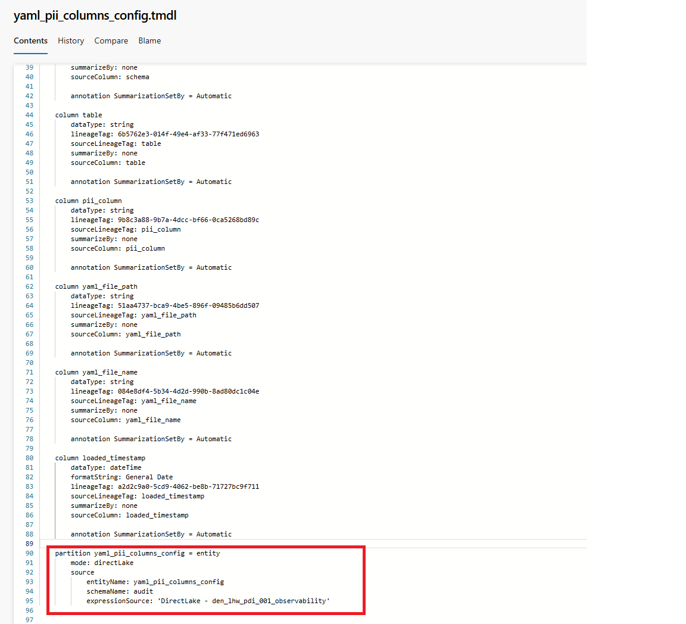
During deployment, the script updates both GUID segments in that URL so the Direct Lake source points to the target environment.

**Example configuration (for `pbi_dst_001_metadata_pii_columns`):**

- **Key:** `sm.pbi_dst_001_metadata_pii_columns.newValue`  
- **Value:** `den_lhw_dpr_001_data_product_tables`


View of semantic model gateway cloud connections afer CI/CD pipeline run to re-map a data connection.

  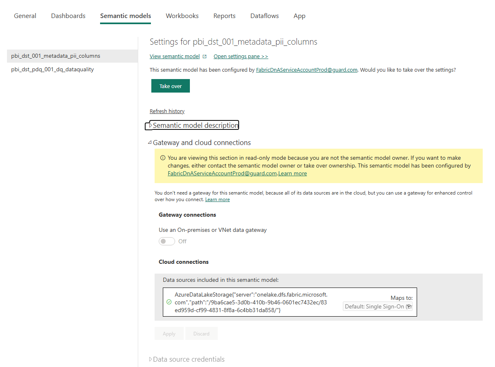

**How values should be set:**
- Create one `sm.<semanticmodel>.newValue` mapping per Direct Lake semantic model.
- Set value to the exact target lakehouse display name present in the target Fabric workspace.
- Ensure lakehouse names are environment-correct (DEV/QA/UAT/PRD).

**What happens during deployment?**
CI/CD rewrites Direct Lake `AzureStorage.DataLake` endpoint URLs in semantic model `.tmdl` files with the target workspace and lakehouse IDs. This ensures Direct Lake models read data from the correct OneLake location after promotion.

**Notes:**
- If no `sm.<semanticmodel>.newValue` mapping exists, replacement is skipped for that semantic model.
- If the mapped lakehouse display name is not found in the target workspace, the script logs a warning and skips replacement.
- This replacement is specific to Direct Lake expressions that use `AzureStorage.DataLake(...)` in `expressions.tmdl`.

#### Manage Fabric Data Pipeline Connection
**Purpose:** This configuration ensures Fabric data pipelines are deployed with the correct environment-specific managed connection by remapping connection GUID references during CI/CD.

**What does this configuration do?**
During deployment, the pipeline compares the original connection name/GUID stored in source-controlled artifacts with target-environment connection metadata, then replaces the old GUID with the mapped target GUID.

**Why is this important?**
Connection GUIDs committed from feature branches are often tied to developer or lower-environment connections. If not remapped, higher-environment deployments (DEV/QA/UAT/PREPRD/PRD) can fail or bind to unintended data sources.

**How does this mapping work?**

Three variable group key/value pairs are used to manage and remap connections:

- **Key:** `mngConnection.<any-name>.guid`  
- **Value:** `<GUID>`

- **Key:** `mngConnection.<any-name>.new-name`  
- **Value:** `<connection-name>`

- **Key:** `mngConnection.<any-name>.original-name`  
- **Value:** `<connection-name>`

**Pipeline logic:**

1. `mngConnection.<any-name>.original-name` lists all data source connections and finds a match for the original connection name stored in DevOps Git.

2. It verifies the associated `mngConnection.<any-name>.guid`.

3. If matched, the old GUID is replaced with the GUID of `mngConnection.<any-name>.new-name` by performing a lookup.

Example: In a higher‑end PRD workspace, you may need to change the GUID from FabricDataPipelines-DevOps-DEV to FabricDataPipelines-DevOps-PRD. The Fabric data pipeline initially only recognizes the DEV GUID, so the configuration ensures it is replaced with the PRD GUID.

View the managed connection for FabricDataPipelines-DevOps-DEV and record its connection ID.
  ```
  ``` 
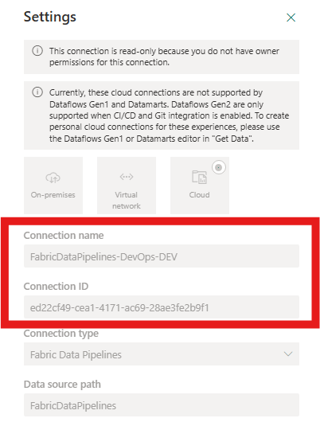

**Update the variable group accordingly.**

**Example configuration:**

- **Key:** `mngConnection.DataPipeline.guid`  
- **Value:** `ed22cf49-cea1-4171-ac69-28ae3fe2b9f1`

- **Key:** `mngConnection.DataPipeline.original-name`  
- **Value:** `FabricDataPipelines-DevOps-DEV`

- **Key:** `mngConnection.DataPipeline.new-name`  
- **Value:** `FabricDataPipelines-DevOps-PRD`

**How values should be set:**
- Use one consistent `<any-name>` group per remapping scenario (for example `DataPipeline`).
- Set `guid` to the current/original connection GUID referenced in source artifacts.
- Set `original-name` to the connection name currently referenced in source.
- Set `new-name` to the connection name that exists in the target environment.

**What happens during deployment?**
CI/CD resolves the target connection by `new-name`, retrieves its GUID, and replaces matching old GUID references in deployed data pipeline artifacts so runtime connections align with the selected environment.

---

## Feature Fabric Workspace Provisioning for Data Engineers

**Purpose:** This section explains how Data Engineers can provision a feature Fabric workspace by cloning the DEV variable group, updating environment-specific values, and running the provisioning pipeline.

**What this section covers:**
- Clone a baseline DEV variable group for feature use.
- Use either manual clone in Azure DevOps Library or the Clone Variable Group pipeline as an alternative for feature branch setup.
- Update required credentials and workspace settings.
- Run the provisioning pipeline with the cloned variable group.
- Apply workspace access guidance for Data Engineers, including the approved admin exception path.

**Why this is important:**
- It gives Data Engineers a controlled, repeatable way to create feature workspaces.
- It keeps feature provisioning aligned with the same CI/CD process used by platform deployments.
- It reduces configuration drift and helps avoid manual workspace setup errors.

**Prerequisites:**
- **Permissions:** You must have `Project Administrator` or `Contributor` access in the Azure DevOps project and rights to manage variable groups.
- **Service Principal:** A service principal with necessary Azure permissions for provisioning resources (ARM_CLIENT_ID, ARM_CLIENT_SECRET, ARM_TENANT_ID).

**Steps:**

1. Clone the PlatformServices Dev variable group
- Navigate to the Azure DevOps project -> Pipelines -> Library -> Variable groups.
- Locate the existing variable group named something like `PlatformServices-<SubDomainName>-Dev` (e.g. `PlatformServices-DelegatedAuthority-DEV`).
- Use the clone action to create a new variable group for your feature workspace. Name it using the pattern `<SuperDomain>-<SubDomainName>-Feature-<data-engineer-name>` (e.g. `Distribution-DelegatedAuthority-Feature-hansolo`).

**Alternative for feature branch creation:**

[Variable Group Cloning Automation Pipeline](#variable-group-cloning-automation-pipeline) 
- Instead of manually cloning in Library, you can run the Clone Variable Group pipeline (`pipelines/utility/clone-variable-group.yml`) to create the feature variable group automatically.
- This option is useful when creating multiple feature branch variable groups.
- After pipeline-based cloning, continue with the same variable updates(if required) and run steps in this section.


  **01 - Select DevOps Project**
    

    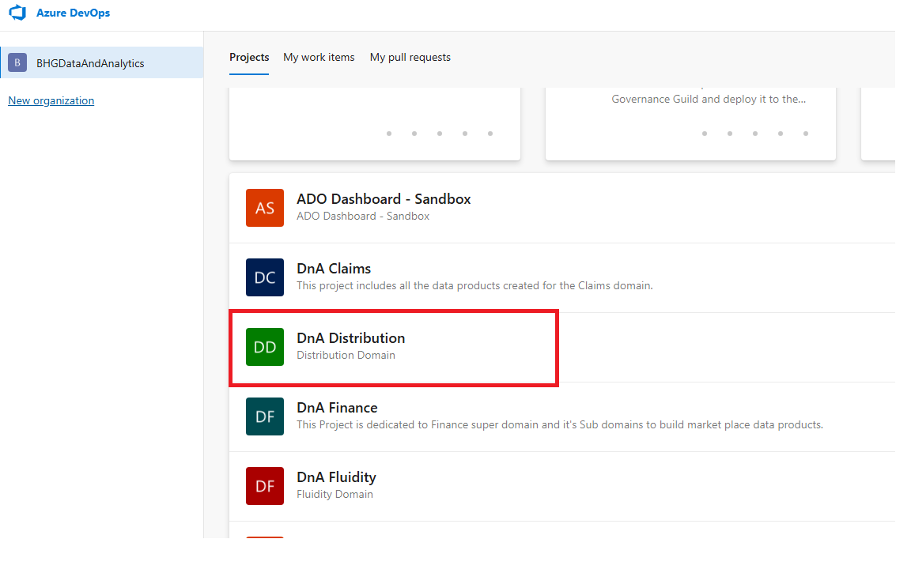
    

  **02 - Variable groups list**
    

    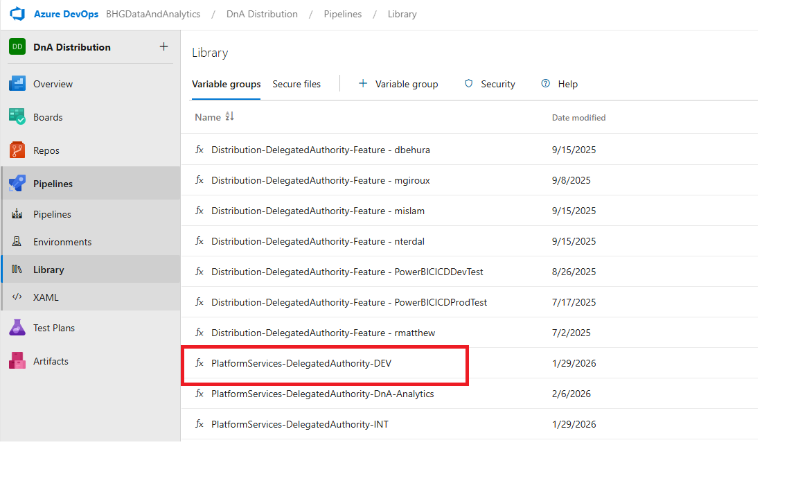
     

  **03 - Clone variable group**
    

    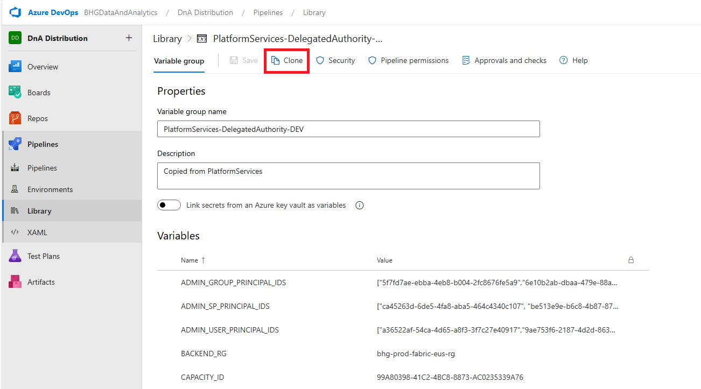
    

  **04- Rename variable group**
    

    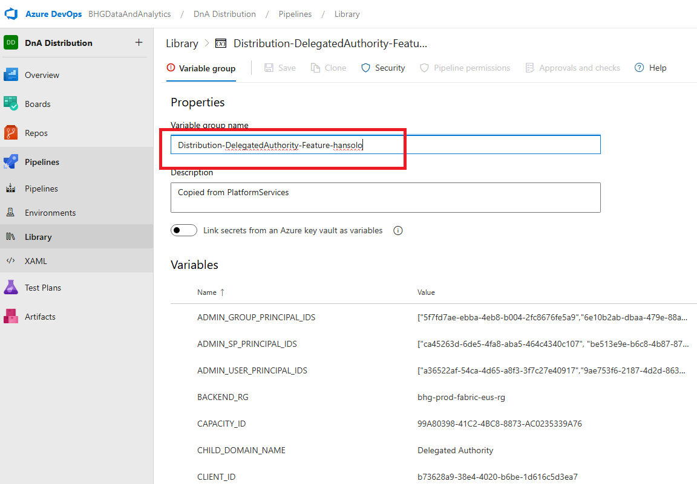


2. Validate variables in the cloned variable group
- Open your new `<SuperDomain>-<SubDomainName>-Feature-<data-engineer-name>` variable group.
- If you used the Clone Variable Group pipeline, variable values are automatically copied/populated from the source variable group.
- If you used manual Library clone, values are usually copied as well, but you should still validate environment-specific fields before running the pipeline.

**Cross-check note (required):**
- Please cross-check that all required variable values are populated before running deployment.
- Pay special attention to secret values and environment-specific values.

Key variables to verify (example names):
- `CLIENT_ID` — service principal client id
- `CLIENT_SECRET` — service principal secret (mark as secret)

    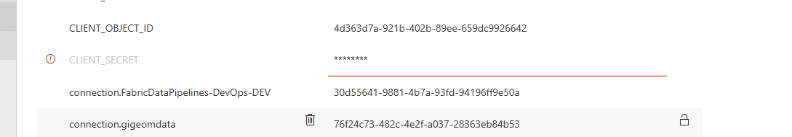

- `TENANT_ID` — Azure tenant id

    

- `SERVICE_ACCOUNT_NAME` - Service account name
- `SERVICE_ACCOUNT_SECRET` - Service account secret key

    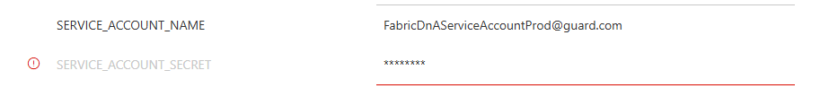

- `ENVIRONMENT` — set to `<data-engineer-name>` (e.g. `hansolo`)

    

- `KEYVAULT_NAME` - Key vault name

    
- `TEAMS_CLIENT_SECRET` - Teams client secret key
- `TEAMS_NOTIFICATION_PASSWORD` - Teams notification password

    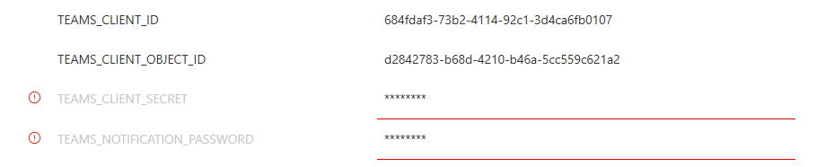

- `WORKSPACE_NAMES` — set to `["<SuperDomain>-<SubDomainName>-Feature-<data-engineer-name>"]` e.g.(`["Distribution-DelegatedAuthority-Feature-hansolo"]`)

    

**Run Pipeline:**

Follow these steps to queue the pipeline that creates the feature workspace. Use the three screenshots below to verify the dialog fields (highlighted boxes) before running.

1. Navigate to Pipelines -> Pipelines in Azure DevOps and locate the pipeline used for feature workspace creation (common names include `<SuperDomain> - <SubDomainName>` or the pipeline defined for your subdomain e.g. `DnA Distribution - Delegated Authority`). Click the pipeline name, then click **Run pipeline**.
  

  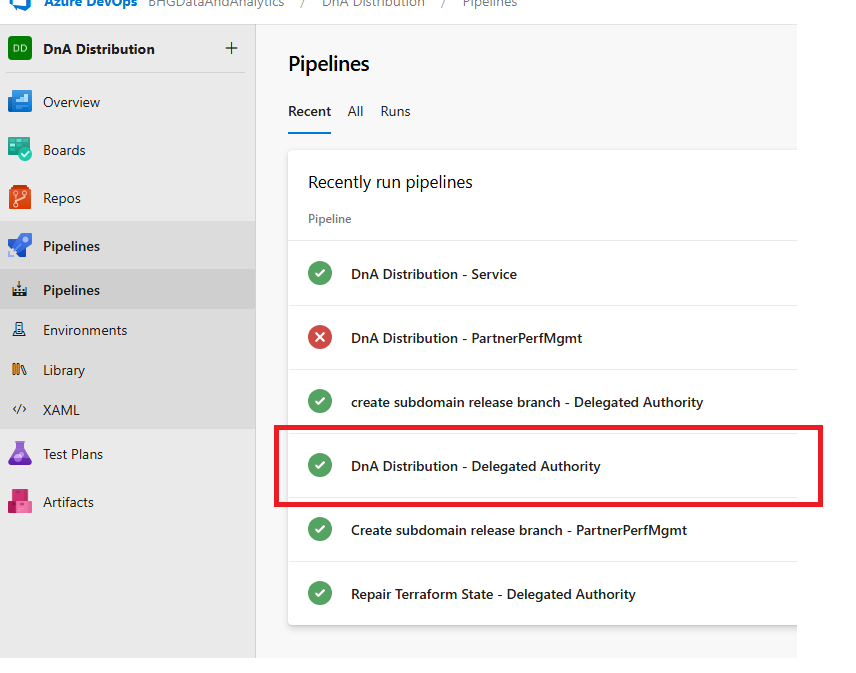
  

  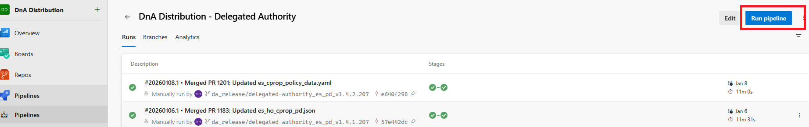
  _Pipline Selection - Pipeline Name and run pipeline highlighted_

2. In the **Run pipeline** dialog:
  - **Branch (highlighted):** select the branch to run from (usually your feature branch).
  - **Variables / Variable groups (highlighted):** open the variables area to select the cloned variable group. Choose the `<SuperDomain>-<SubDomainName>-Feature-<data-engineer-name>` group you created earlier.

3. The highlighted parameters in the run pipeline dialog are the pipeline's default selections and should NOT be modified during the first-time creation of a feature workspace.

4. Click **Run** to start the pipeline. Monitor the pipeline logs and wait for provisioning to complete. On success, the new workspace specified in `WORKSPACE_NAMES` will be created.

  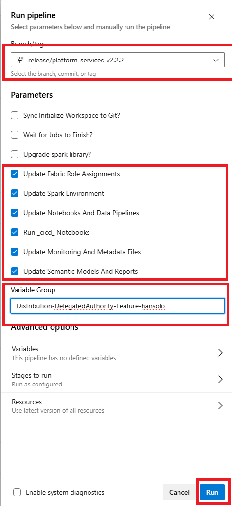
    
  _Pipeline Dialog-Select branch, add variable grou and run._

**How to add Data Engineers as Fabric workspace Admin:**

Before elevating Data Engineers to admin access, confirm an approved need for admin-level access (for example, a platform-reviewed troubleshooting or setup requirement). You can grant admin access using either the Data Engineers security group or individual admin service accounts, depending on your governance preference.

**Option A: Add via Admin Groups**

1. Locate the Microsoft Entra ID object ID for the Data Engineers security group (e.g., `GUARD DnA - <domain> <subdomain> - Data Eng`).
2. Add that object ID to `ADMIN_GROUP_PRINCIPAL_IDS` in the selected variable group (same approach used in the [Workspace Manage Access - Admin Users](#workspace-manage-access---admin-users) section).
3. Rerun the workspace deployment pipeline so workspace Manage Access settings are reapplied.
4. Validate in Fabric Workspace Manage Access that the Data Engineers group appears as Admin.

**Option B: Add via Admin Users (Service Accounts)**

1. If individual admin service accounts should be granted access instead of or in addition to the group, locate the Microsoft Entra ID object IDs for the required service accounts (e.g., `FabricDnAServiceAccountProd@guard.com`, `FabricDnAServiceAccountDev@guard.com`).
2. Add those object IDs to `ADMIN_USER_PRINCIPAL_IDS` in the selected variable group (same approach used in the [Workspace Manage Access - Admin Service Account](#workspace-manage-access---admin-service-account) section).
3. Rerun the workspace deployment pipeline so workspace Manage Access settings are reapplied.
4. Validate in Fabric Workspace Manage Access that the admin service accounts appear with Admin role.

**Recommendation:**
- Use Admin assignment only for approved exceptions and remove elevated access when no longer needed.
- Use Option A (groups) for team-based governance; use Option B (service accounts) for shared automation/pipeline accounts that need elevated provisioning rights.

---

## Variable Group Cloning Automation Pipeline   

Automated clone using the `utility/clone-variable-group.yml` pipeline
---------------------------------------------------------------
Purpose: Use the pipeline `pipelines/utility/clone-variable-group.yml` to clone an existing variable group into a feature variable group programmatically.

Prerequisites:
- You have `Project Administrator` or `Contributor` access to the Azure DevOps project.
- The pipeline has permissions to read and create variable groups (pipeline or service principal configured with appropriate scopes).

How to run (UI):

If pipeline is not configured 
  1. In Azure DevOps navigate to Pipelines -> Pipelines -> New pipeline.
  2. Choose the repository and select the YAML file path `pipelines/utility/clone-variable-group.yml` in the branch you want to run.
  3. Rename the pipeline to `Clone Variable Group`
  3. Click **Run pipeline** and supply the required run-time variables (see example below).

Pipeline parameters (defined in `pipelines/utility/clone-variable-group.yml`):
- `copyFromVariableGroupName`: `<Domain>-<SubDomainName>-DEV`  (Variable Group to Clone)
- `userName`: `jdoe` (Engineer name, used to form the target feature group name)

**Select Clone Variable Group Pipeline** 

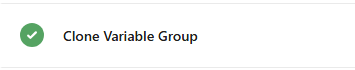

**Click Run Pipeline** 

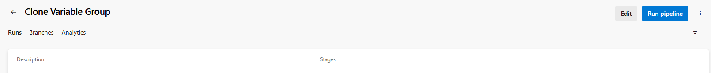

**Provide Required Paramenters**

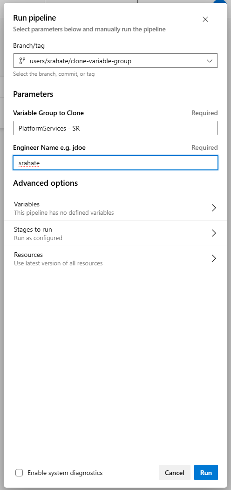

**Pipeline Execution Steps**

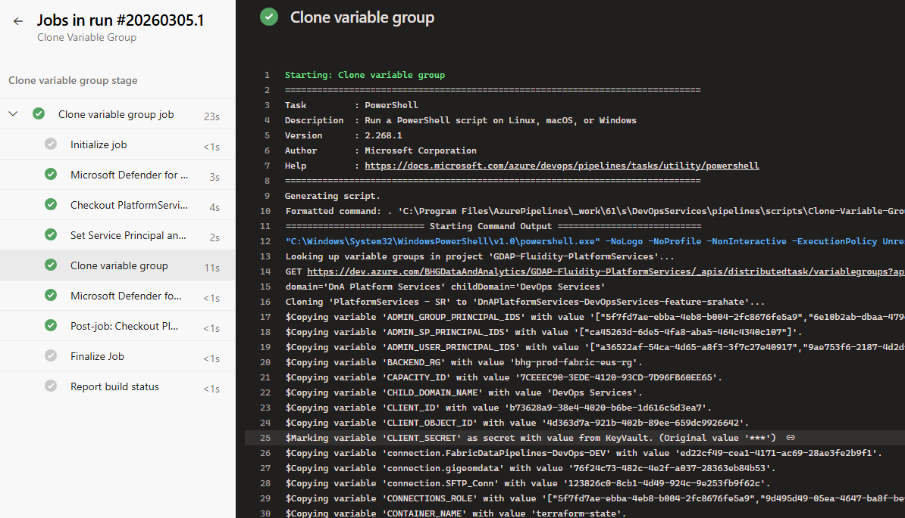

Notes and behavior:
- The pipeline will attempt to copy secret values; if secrets cannot be retrieved the pipeline will create the target variable as an empty/placeholder secret and you must populate it in the Library after cloning.
- Non-secret values are copied as-is.
- The pipeline will create the target variable group if it does not exist; it will not modify an existing group's values.
- The pipeline will fail if the target variable gorup exist.

Post-run: verify the new variable group in Pipelines -> Library -> Variable groups and update missing/any secret placeholders.

---

## Setting Schedules-Fabric items

**Purpose:** This feature enables you to configure automatic, recurring execution schedules for Fabric artifacts directly through source control using `.schedules` files. Instead of manually creating schedules in the Fabric UI for each environment, you commit schedule definitions to your repository, and the CI/CD pipeline automatically creates and applies them during workspace deployment.

**What this feature does:**
When you place a `.schedules` configuration file alongside a Fabric artifact (Notebook, DataPipeline, or SparkJobDefinition), the CI/CD pipeline detects it during deployment, validates the configuration, and creates the corresponding schedule in the target Fabric workspace. This approach ensures schedules are:
- Version-controlled and auditable
- Consistently applied across DEV/QA/UAT/PREPRD/PRD environments
- Deployable as part of the standard CI/CD process
- Easily updated by modifying source control rather than manual UI steps

**Why this is important:**
Automating schedule creation eliminates manual configuration, reduces deployment inconsistency, and ensures scheduled workloads start reliably when promoted to higher environments. It also provides a clear audit trail of when and how schedules were configured.

**Location and file format:**

Place a file named `.schedules` in the artifact folder. The file should be a sibling to the artifact's folder, following this naming pattern:

`src/fabric/<service>/<artifact-type>/<artifact-name>.<artifact-type>/.schedules`

**Example locations:**
- Notebook schedule: `src/fabric/common/notebooks/den_nbk_pdi_001_workspace_parameters.Notebook/.schedules`
- DataPipeline schedule: `src/fabric/engineering_service/data_pipelines/daily_ingestion_pipeline.DataPipeline/.schedules`
- Spark Job schedule: `src/fabric/engineering_service/spark_jobs/claim_transform_job.SparkJobDefinition/.schedules`

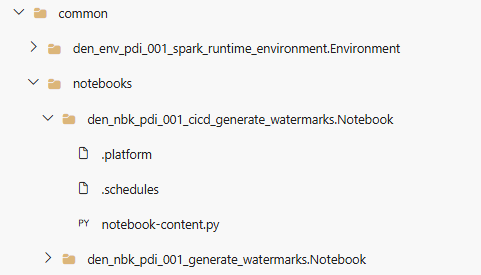

**Example `.schedules` file structure:**

```json
{
  "$schema": "https://developer.microsoft.com/json-schemas/fabric/gitIntegration/schedules/1.0.0/schema.json",
  "schedules": [
    {
      "enabled": true,
      "jobType": "Execute",
      "configuration": {
        "type": "Cron",
        "startDateTime": "2026-03-19T22:52:00",
        "endDateTime": "2027-03-19T22:52:00",
        "localTimeZoneId": "Eastern Standard Time",
        "interval": 15
      }
    }
  ]
}
```

**Key fields explained:**

- **enabled**: Boolean (`true` or `false`) that determines whether the schedule is active after deployment.
  - `true`: Schedule is created and active in the target workspace immediately after deployment.
  - `false`: Schedule is created but disabled; you can enable it manually in Fabric if needed later.
  - Use this to control whether experimental or non-critical schedules should run automatically.

- **jobType**: Specifies the type of job the artifact represents. This tells the CI/CD pipeline which Fabric execution model to use:
  - `Execute`: Used for Notebooks that run interactively or with parameters.
  - `sparkjob`: Used for SparkJobDefinitions that execute as batch Spark jobs.
  - The pipeline uses this value to map the schedule to the correct Fabric job type.

- **configuration.type**: Defines the recurrence pattern for the schedule. Supported values:
  - `Cron`: Fixed interval-based scheduling (every N minutes).
  - `Daily`: Runs at specific times on every day.
  - `Weekly`: Runs at specific times on selected weekdays.
  - `Monthly`: Runs at specific times on selected dates or ordinal weekdays.

- **startDateTime / endDateTime**: ISO 8601 timestamps that define the active time window for the schedule.
  - Format: `YYYY-MM-DDTHH:MM:SS` (for example, `2026-03-19T22:52:00`)
  - The schedule is only active between these dates; outside this window, executions do not run.
  - Use `endDateTime` in the future to keep schedules perpetually active, or set it to a specific date to temporarily disable a schedule without removing the configuration.

- **localTimeZoneId**: Windows time zone identifier used to interpret times in the schedule configuration.
  - Examples: `Eastern Standard Time`, `Central Standard Time`, `India Standard Time`, `UTC`
  - This is especially important for `Daily`, `Weekly`, and `Monthly` schedules where times are specified as `times: ["15:00"]`.
  - The pipeline converts configured times to the workspace's timezone when creating the schedule.

- **interval** (Cron only): Numeric value in minutes representing the fixed interval for `Cron` type schedules.
  - Example: `15` means every 15 minutes.
  - Example: `60` means every 60 minutes (hourly).
  - Use small intervals for frequent monitoring/data ingestion; use large intervals for heavy computation jobs to avoid overloading capacity.

- **times** (Daily/Weekly/Monthly): Array of execution times in `HH:MM` format.
  - Example: `["15:00"]` for a single daily run at 3:00 PM.
  - Example: `["09:00", "18:00"]` for runs at 9:00 AM and 6:00 PM.
  - All times are interpreted using the specified `localTimeZoneId`.

- **weekdays** (Weekly only): Array of day names for weekly recurrence.
  - Valid values: `"Sunday"`, `"Monday"`, `"Tuesday"`, `"Wednesday"`, `"Thursday"`, `"Friday"`, `"Saturday"`.
  - Example: `["Monday", "Wednesday", "Friday"]` runs the schedule three times per week.

- **recurrence** (Monthly only): Integer defining how many months between executions (typically `1` for monthly).

- **occurrence** (Monthly only): Object defining which date(s) in the month to run:
  - `occurrenceType: "DayOfMonth"` with `dayOfMonth: 1` runs on the 1st of every month.
  - `occurrenceType: "OrdinalWeekday"` with `weekIndex: "Second"` and `weekday: "Monday"` runs on the second Monday of every month.

**Requirements for schedule deployment:**

Each artifact folder that includes a `.schedules` file must also contain a `.platform` file with metadata that identifies the artifact:

```json
{
  "metadata": {
    "type": "Notebook",
    "displayName": "den_nbk_pdi_001_workspace_parameters"
  }
}
```

**Why `.platform` metadata is required:**
- `type`: Tells the pipeline whether the artifact is a `Notebook`, `DataPipeline`, or `SparkJobDefinition`. Only these types support scheduling.
- `displayName`: Must match the artifact's display name in Fabric exactly. The pipeline uses this to locate the correct artifact when creating the schedule.

**Validation rules:**
- If the `.platform` file is missing or has incorrect `metadata.type`, the pipeline skips schedule creation with a warning.
- If `displayName` does not match any artifact in the target workspace, schedule creation fails and the deployment logs indicate the mismatch.
- If the artifact type is not one of the three supported types, the schedule is skipped silently.
- All `startDateTime`, `endDateTime`, and `times` must be valid ISO 8601 format or valid `HH:MM` format respectively.

**Common schedule configuration patterns:**

Choose a schedule type based on your workload requirements:

**Cron (Fixed Interval) — For frequent, regular executions:**

Best for: Real-time data ingestion, continuous monitoring, periodic data quality checks.

Use when: You need executions at fixed intervals regardless of the time of day.

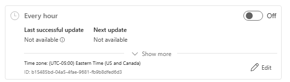

Example — Every 60 minutes (hourly):
```json
    {
      "enabled": true,
      "jobType": "sparkjob",
      "configuration": {
        "type": "Cron",
        "startDateTime": "2026-03-19T22:54:00",
        "endDateTime": "2027-03-26T22:54:00",
        "localTimeZoneId": "Eastern Standard Time",
        "interval": 60
      }
    }
```

**Daily — For single or multiple daily executions:**

Best for: Daily batch processing, overnight data loads, end-of-day reconciliation.

Use when: You need the job to run at specific times every day.

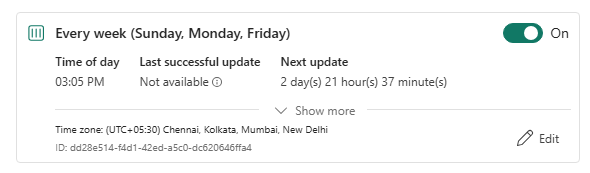

Example — Daily at 3:00 PM:
```json
    {
      "enabled": true,
      "jobType": "sparkjob",
      "configuration": {
        "type": "Daily",
        "startDateTime": "2026-03-19T00:00:00",
        "endDateTime": "2027-03-19T00:00:00",
        "localTimeZoneId": "Eastern Standard Time",
        "times": [
          "15:00"
        ]
      }
    }
```

**Weekly — For jobs that run on specific days of the week:**

Best for: Weekly data aggregations, weekend heavy-compute jobs, midweek reporting refreshes.

Use when: You need the job to run only on certain weekdays at specific times.

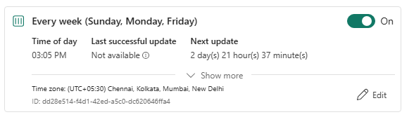

Example — Every Monday, Wednesday, and Friday at 3:05 PM:
```json
    {
      "enabled": true,
      "jobType": "sparkjob",
      "configuration": {
        "type": "Weekly",
        "startDateTime": "2026-03-19T00:00:00",
        "endDateTime": "2027-03-19T00:00:00",
        "localTimeZoneId": "India Standard Time",
        "times": [
          "15:05"
        ],
        "weekdays": [
          "Sunday",
          "Monday",
          "Friday"
        ]
      }
    }
```

**Monthly (fixed date) — For jobs that run on specific dates each month:**

Best for: Month-end reporting, monthly reconciliation, billing cycle processing.

Use when: You need the job to run on the same calendar date every month (e.g., always the 1st).

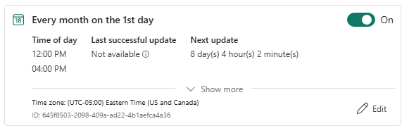

Example — On the 1st of every month at 12:00 PM and 4:00 PM:
```json
    {
      "enabled": true,
      "jobType": "sparkjob",
      "configuration": {
        "type": "Monthly",
        "startDateTime": "2026-03-19T00:00:00",
        "endDateTime": "2027-03-19T00:00:00",
        "localTimeZoneId": "Eastern Standard Time",
        "times": [
          "12:00",
          "16:00"
        ],
        "recurrence": 1,
        "occurrence": {
          "occurrenceType": "DayOfMonth",
          "dayOfMonth": 1
        }
      }
    }
```

**Monthly (ordinal weekday) — For jobs that run on a specific weekday of each month:**

Best for: Jobs that need to run on business-aligned dates (e.g., second Monday for team reports).

Use when: You need the job to run on a relative weekday (e.g., "second Monday", "last Friday") rather than a fixed calendar date.

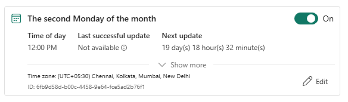

Example — Every second Monday of the month at 12:00 PM:
```json
    {
      "enabled": true,
      "jobType": "sparkjob",
      "configuration": {
        "type": "Monthly",
        "startDateTime": "2026-03-19T00:00:00",
        "endDateTime": "2027-03-19T00:00:00",
        "localTimeZoneId": "India Standard Time",
        "times": [
          "12:00"
        ],
        "recurrence": 1,
        "occurrence": {
          "occurrenceType": "OrdinalWeekday",
          "weekIndex": "Second",
          "weekday": "Monday"
        }
      }
    }
```

**Selection guidance:**
- Use **Cron** for high-frequency operations where consistent intervals matter more than clock times.
- Use **Daily** for most batch workloads (data loads, refreshes) that run once or a few times per day.
- Use **Weekly** when you want to skip certain days to reduce compute or because data is only meaningful on those days.
- Use **Monthly (fixed date)** for month-end operations that must run on the same calendar date.
- Use **Monthly (ordinal weekday)** when the business process is tied to a specific weekday (e.g., "first business day of the month").

**How schedule creation is executed during CI/CD deployment:**

**Pipeline automation flow:**
1. **Detection:** When the infrastructure pipeline at `DevOpsServices/pipelines/infrastructure/azure-pipelines.yml` runs, it includes a task named **Set Job Schedulers**.
2. **Script execution:** This task invokes the PowerShell script `DevOpsServices/pipelines/scripts/Invoke-SchedulesManagment.ps1`.
3. **File discovery:** The script recursively scans the repository for all `.schedules` files in artifact folders.
4. **Validation:** For each discovered `.schedules` file, the script:
   - Locates the accompanying `.platform` file to read artifact `type` and `displayName`.
   - Validates the JSON schema against `https://developer.microsoft.com/json-schemas/fabric/gitIntegration/schedules/1.0.0/schema.json`.
   - Confirms the artifact type is one of the three supported types: `Notebook`, `DataPipeline`, or `SparkJobDefinition`.
   - Verifies that the `displayName` exists in the target Fabric workspace.
5. **Schedule creation:** For each valid schedule, the script calls `Create-ItemSchedule.ps1` with the following parameters:
   - Target workspace name (from variable group `WORKSPACE_NAMES`)
   - Artifact name (from `.platform` metadata)
   - Schedule configuration (from `.schedules` file)
   - Target environment information
6. **Deployment:** Schedules are created in the target Fabric workspace with the specified `enabled` state.

**How to enable schedule creation in the pipeline UI:**

When you queue the infrastructure pipeline in Azure DevOps:
1. Navigate to the pipeline run dialog.
2. Look for a pipeline variable or checkbox option named **Enable Scheduler** or **Schedule Option**.
3. Check/enable this option to execute the schedule management step during deployment.
4. Without this option enabled, the pipeline skips schedule creation even if `.schedules` files are present.

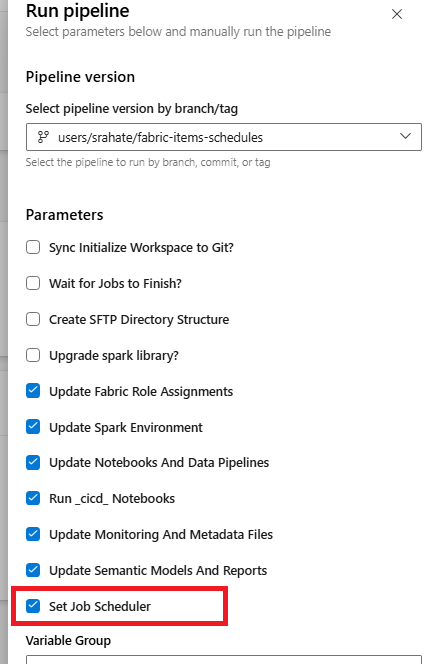

**Post-deployment behavior:**
- Schedules created with `"enabled": true` are immediately active and will execute according to their configuration.
- Schedules created with `"enabled": false` are dormant; you can enable them manually in Fabric Workspace if needed.
- If a schedule already exists in the target workspace (from a previous deployment) with the same artifact name, the pipeline updates it with the new configuration.
- Schedules are only created or updated for artifacts that exist in the target workspace; missing artifacts result in a skipped schedule (not a failure).

**Environment-specific schedule considerations:**
- Schedule times should account for environment-specific timings (DEV might need more frequent runs for testing; PRD might need off-peak times).
- Use `startDateTime` and `endDateTime` to control when schedules are active; for example, disable a schedule in lower environments by setting `endDateTime` to a past date.
- The same `.schedules` file is deployed to all environments.

**Best practices for CI/CD schedule deployment:**
1. Always include both `.schedules` and `.platform` files together in your commits.
2. Test schedule configurations in DEV before promoting to higher environments.
3. Use `enabled: false` for experimental schedules that should be created but not automatically run.
4. Set reasonable `startDateTime` and `endDateTime` windows; avoid schedules that extend indefinitely into the future.
5. Validate that the target artifact exists in the workspace before the pipeline creates its schedule (the script checks this automatically).

**Notes and important considerations:**

**Supported artifact types:**
Only these three artifact types support scheduling:
- `Notebook` — Executes notebook code with the specified `jobType: "Execute"`.
- `DataPipeline` — Triggers Fabric data pipeline runs with the specified `jobType: "DataPipeline"`.
- `SparkJobDefinition` — Submits Spark batch jobs with the specified `jobType: "sparkjob"`.

If you try to create a schedule for an unsupported artifact type, the pipeline skips it with a warning in the deployment logs.

**Validation and error handling:**
- **Missing `.platform` file:** If a `.schedules` file exists but there is no accompanying `.platform` file, the schedule is skipped and a warning is logged.
- **Invalid `displayName`:** If the `.platform` metadata references an artifact that does not exist in the target workspace, the schedule creation fails with a clear error message indicating the missing artifact.
- **JSON schema errors:** If the `.schedules` JSON is malformed, validation fails and the error is logged; the pipeline continues processing other schedules.
- **Unsupported artifact type:** If `.platform` specifies a `type` other than the three supported types, the schedule is silently skipped.
- **Timezone issues:** If `localTimeZoneId` references an invalid Windows timezone, the deployment logs indicate the error; use standard Windows timezone names (e.g., `"Eastern Standard Time"`, `"UTC"`).

**Limitations and constraints:**
- Schedule definitions are one-way: CI/CD creates or updates schedules in Fabric, but manual changes made in Fabric UI are not synced back to source control.
- If you delete a `.schedules` file from the repository, the corresponding schedule in Fabric is **not** automatically deleted; you must manually remove it from the Fabric workspace.
- Each artifact can have at most one `.schedules` file; you cannot define multiple independent schedules per artifact through source control (though you can configure multiple entries in the `schedules` array within a single file).
- The pipeline does not support conditional schedule creation based on variable values; schedules are created the same way regardless of environment.

**Troubleshooting:**
- **Schedules not appearing after deployment:** Verify that the **Schedule Option** was enabled when queuing the pipeline. Check the deployment logs for validation errors.
- **Schedule validation errors:** Review the deployment logs for specific error messages; common issues are missing `.platform` files, invalid artifact names, or malformed JSON.
- **Artifact not found:** Confirm that the artifact (with the exact name and type specified in `.platform`) exists in the target Fabric workspace before deployment.
- **Schedule running at wrong time:** Verify that `localTimeZoneId` matches the timezone you intend; times are interpreted relative to this setting, not UTC.

