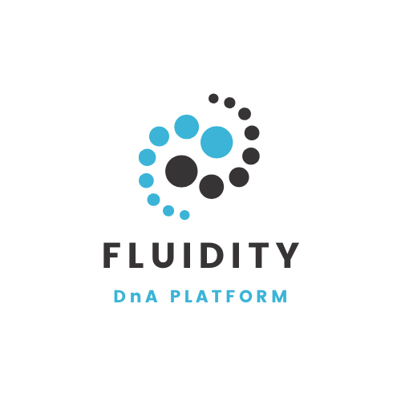

Fluidity is a managed data platform which enables GUARD domains to accelerate the ingestion, loading, transformation/modelling and sharing of data products. Some key features include:
* Ingestion from file and database sources, with configurable load strategies
* Metadata-based configuration
* Data quality validation and alerting using user-configurable rules
* Support for multiple data products
* Support for pre-configured data pipelines (downstream proceses can be extendend via custom data pipelines or notebooks)
* Logging and reporting (for data quality, execution metrics)
* Support for custom code (e.g. Data pipelines, Notebooks) packaging for deployment

# Repo structure
Deeper directory levels are documented in per-component README files (linked below).

| Directory/file name                                       | Description                                               |
| --------------------------------------------------------- | --------------------------------------------------------- |
| [DevOpsServices](DevOpsServices/README.md)               | DevOps and CI-CD assets                                   |
| [VariableGroup](DevOpsServices/VariableGroup-README.md)  | Variable Group configuration                              |
| [docs](docs/README.md)                                   | Documentation                                             |
| [fabric](src/fabric/README.md)                           | Fabric assets                                             |
| [data_product](metadata/data_product/README.md)          | Data products assets                                      |
| [data_quality](data_quality/README.md)                   | Data quality assets                                       |
| [datasets](metadata/datasets/README.md)                  | Ingestion assets                                          |
| [feeds](metadata/feeds/README.md)                        | Orchestration assets                                      |
| [templates](templates/README.md)                         | Data transformation assets                                |

# Getting started
See [CONTRIBUTING.md](/CONTRIBUTING.md) if you want to contribute to Fluidity.

Deployments are organised by the Fluidity Sub Domain team as part of project management. It's not possible to run Fluidity locally (e.g., for testing purposes).

# Contacting the core team
Please email:
* [Fluidity_support@guard.com](mailto:Fluidity_support@guard.com) for support inquiries
* [FluidityproductDevelopment@guard.com](mailto:FluidityproductDevelopment@guard.com) for everything else