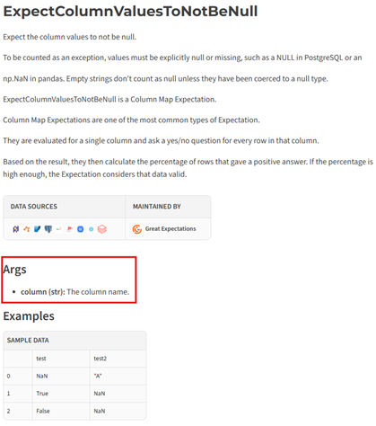

# Data Quality Config
The data quality is configured using a JSON file in the sub-domain repo. The file is a representation of the dim_dq_data_quality_rules table in the observability lakehouse and the data should be added to the table during the CICD process. When a rule needs to be updated or added then the JSON file should be updated and committed to the sub-domain repo.

The JSON file is an array of objects where each object represents a row in the table.

## Format
```json
[
    {
        "dq_rule_master_key": 1,
        "dq_rule_id": "Policy Format",
        "data_product_name": "HOP",
        "sub_domain_name": "Delegated Authority",
        "dq_rule_description": "Check policy number matches the format.",
        "dq_rule_constraint": {
            "type": "expect_column_values_to_match_regex",
            "kwargs": {
                "column": "policy_number",
                "regex": "[A-Z]\\d[A-Z]{2}\\d{6}$"
            },
            "meta": {
                "action": {
                    "fail_threshold": 0.0,
                    "warn_threshold": 0.0,
                    "quarantine": false
                }
            }
        },
        "dq_rule_dimension": "Dimension",
        "dq_screen_type": "Column Screen",
        "dq_rule_applicable_lakehouse": "curated",
        "dq_rule_applicable_schema": "hop",
        "dq_rule_applicable_object": "ho_policy_data",
        "dq_rule_applicable_attribute": "",
        "dq_rule_failure_action": "",
        "dq_rule_severity_score": 0.0,
        "is_current_flag": true,
        "row_effective_date": "1900-01-01T00:00:00.000Z",
        "row_expiration_date": "9999-12-31T00:00:00.000Z"
    }
]
```

| Property | Data Type | Description |
| - | - | - |
| dq_rule_master_key | int | The unique identifier for the row. Since this is manually generated, it is important to ensure this value is unique. This value will be used to relate the dim_dq_rule_master table to the error event fact tables.
| dq_rule_id | string | The name of the data quality rule.
| data_product_name | string | The name of the data product. Because there is only one data quality table per workspace, this can be used to differentiate data products.
| sub_domain_name | string | Name of the sub-domain.
| dq_rule_description | string | Description of the rule and it's purpose.
| dq_rule_constraint | object | The definition of the data quality rule is a JSON object that should conform to the expected format used by Great Expectations. [The format can be found below](#Great-Expectations).
| dq_rule_dimension | string | Descriptive column about the rule.
| dq_screen_type | string | Type of screen being performed.
| dq_rule_applicable_lakehouse | string | Name of the target table's lakehouse that the rule applies. When the ingest or transform service runs, it will check the dim_dq_rule_master table for any rules to run based on this value.
| dq_rule_applicable_schema | string | Name of the target table's schema that the rule applies. When the ingest or transform service runs, it will check the dim_dq_rule_master table for any rules to run based on this value.
| dq_rule_applicable_object | string | Name of the target table that the rule applies. When the ingest or transform service runs, it will check the dim_dq_rule_master table for any rules to run based on this value.
| dq_rule_applicable_attribute | string | Descriptive column about the rule.
| dq_rule_failure_action | string | Descriptive column about the action on failure. This is does not have any affect on the behavior of the rule.
| dq_rule_severity_score | string | Descritive column about the severity score. This is does not have any affect on the behavior of the rule.
| is_current_flag | bool | Defines if the row is active. The dim_dq_rule_master table behaves like a type two dimension where only active records are used when applying rules to the dq_rule_applicable_object. If using the platform notebook `den_nbk_pdq_001_write_dq_rules` to write the rules then this will be hardcoded as `true`.
| row_effective_date | string | Start date of the record. The rule will apply if the current date is between the row_effective_date and the row_expiration_date. If using the platform notebook `den_nbk_pdq_001_write_dq_rules` to write the rules then this will be hardcoded as `1900-1-1`.
| row_expiration_date | string | End date of the record. The rule will apply if the current date is between the row_effective_date and the row_expiration_date. If using the platform notebook `den_nbk_pdq_001_write_dq_rules` to write the rules then this will be hardcoded as `9999-12-31`.

## Great Expectations
Great Expectations open source python library is being leveraged to execute the data quality rules. The rules should be defined in the JSON object format expected by a Great Expectation Suite.

The format for the expectation is the following:

```json
{
    "type": "expect_column_values_to_not_be_null",
    "kwargs": {
        "column": "policy_number"
    },
    "meta": {
        "action": {
            "fail_threshold": 0.0,
            "warn_threshold": 0.0,
            "quarantine": false
        }
    }
}
```

There are three parts to the expectation.

1. **type**: The type of expectation to be run. You can choose an expectation from the [expectation gallery](https://greatexpectations.io/expectations/). The name of the expectation in the gallery should be converted to snake case, where each space is replaced with an underscore (_) character.
2. **kwargs**: The key word arguments for the type of expecation. Each expectation has a different set of kwargs and can be found in the expectation gallery under the **Args** section.



3. **meta**: Any metadata about the expecation. This is free space to use for anything. The platform service uses it to define actions such as thresholds.

## Meta Actions

The actions allow for defining the failure threshold, warning threshold, and quarantine flag.

```json
"meta": {
    "action": {
        "fail_threshold": 0.0,
        "warn_threshold": 0.0,
        "quarantine": false
    }
}
```

The `fail_threshold` is the percentage of records that must successfully pass the test or the test will fail. If a test fails then the overall data quality for the target table is considered a fail and data will not be written to the target table or quarantine table. However, the events will still be logged to the observability lakehouse in the event fact tables.

The `warn_threshold` is the percentage of records that must successfully pass the test or the test will flag a warning. If the warning is triggered then the DQ service will return a `warn = true` result to the caller.

The `quarantine` flag will tell the DQ process to redirect any records that failed the test to a secondary target table with the suffix `_quarantine`.

In the example above, the `fail_threshold` is set to 0.0 which means the test will never trigger a failure and records will always be written to the target table. This means we can run the test and log the results while letting all records pass.

## ExpectColumnValuesToBeInLookup
There is a custom expectation, `ExpectColumnValuesToBeInLookup`. This expectation does not exist in the Great Expecations gallery. The expectation must be used in conjunction with the meta tag lookup_config. It will look like the below example.

In this example, the `state` column of the tested dataset must contain values in the `dim_state.state_code` column. If the value doesn't exist in the lookup table then the record will fail the test. 
- The `filter` property is optional and is a spark sql expression (dataframe filter).
- The `allow_missing_lookup` option will let the DQ check pass if the lookup table does not exist yet.
- The `allow_null_values` option will let records pass the check if they are null.
- The `date_column`, `start_date_column`, and `end_date_column` are used to change the behavior of the lookup join. The `date_column` is the date column from the source data that must be between the `start_date_column` and `end_date_column` in the lookup table. The logic is `date_column >= start_date_column and date_column <= end_date_column`.

```py
{
    "type": "expect_column_values_to_be_in_lookup",
    "kwargs": {
        "column": "state"
    },
    "meta": {
        "action": {
            "fail_threshold": 90.0,
            "warn_threshold": 90.0,
            "quarantine": False
        },
        "lookup_config": {
            "lakehouse": "Model",
            "schema": "hop",
            "table": "dim_state",
            "column": "state_code",
            "filter": "country = 'US'",
            "allow_missing_lookup": False,
            "allow_null_values": False,
            "date_column": "date",
            "start_date_column": "start_date",
            "end_date_column": "end_date"
        }
    }
}
```

### ExpectKeyToNotExist
There is a custom expectation class, `ExpectKeyToNotExist` which looks up the key values in the target table to ensure they do not exist already. The expectation must be used in conjunction with the meta tag `config`. It will look like the below example.

The kwargs must exist in the expectation and because it cannot be blank, the column kwarg should be there with the name left empty. The meta section will behave like usual. The config section is optional and has two properties.

1. **filter:** This is a spark SQL filter that will be applied to the target table and can be used to reduce the target lookup rows. This can be useful for limiting the history of the table to a specified time frame.

1. **hash_check:** This option will use the hash columns to compare the source and target records to see if anything has changed. This means that even though the source row exists in the target already, the DQ check will not fail unless the hash is different.

```py
{
    "type": "expect_key_to_not_exist",
    "kwargs": {
        "column": ""
    },
    "meta": {
        "action": {
            "fail_threshold": 0,
            "warn_threshold": 0,
            "quarantine": True
        },
        "config": {
            "filter": "dl_row_update_timestamp >= date_add(current_timestamp, -180)",
            "hash_check": True
        }
    }
}
```

## Sample Template
A sample template with a data quality rule can be found [here](/docs/templates/dim_dq_rule_master_template.json).

## Testing DQ Rules Without Running the Pipeline
DQ rules can be run and tested during development in a notebook by using the platform services python library.

Create a notebook and attach the spark environment `den_env_pdi_001_spark_runtime_environment`

```py
# DQ event tales must exist in den_lhw_pdi_001_observability lakehouse
from spark_engine.data_quality.data_quality import Expectations

file_path = "abfss://5e49f81d-f646-4bb3-8785-cbb0699886ef@onelake.dfs.fabric.microsoft.com/304e6b35-e159-4940-a089-968fdbd3ab3f/Files/user_data/lookup_test"
df = spark.read.format("csv").option("header", "true").csv(file_path)

expectations = [
    {
        "type": "expect_column_values_to_not_be_null",
        "kwargs": {
            "column": "state"
        },
        "meta": {
            "action": {
                "fail_threshold": 90.0,
                "warn_threshold": 90.0,
                "quarantine": False
            },
            "dq_rule_master_key": 1,
            "dq_rule_id": "1"
        }
    }
]

dq = (
    Expectations(
        lakehouse_name="den_lhw_pdi_001_hop_curated",
        schema_name="dbo",
        table_name="csv_test",
        batch_data=df,
        expectations=expectations # optional parameter that can be used to pass a list of expectations manually instead of reading from dim_dq_rule_master
    )
)
```

```py
# set expectations using the dim_dq_rule_master table
# can remove the expectations parameter above if using this option
dq.set_expectations(
    target_table,
    target_schema,
    target_lakehouse_name
)
```

```py
# view expectations before performing
print(dq.expectations)
```

```py
# run dq rules against the dataset
dq.perform_expectations(index_column_names=["policy_number"]) # primary key of the data must be defined for logging to dq event tables
```

```py
display(dq.expectation_df) # contains original dataset plus dq result columns
print(dq.expectation_metrics)
```

```py
dq.quarantine() # perform the quarantine of records. This will redirect records from expectation_df to the quarantine table by writing the data to the lakehouse
print(dq.quarantine_metrics) # view the quarantine results
```

## den_nbk_pdq_001_write_dq_rules
This is a notebook provided by platform services to assist in reading the DQ Rules JSON and writing it to the `dim_dq_rule_master` table.

## den_nbk_pdq_001_dq_template_conversion
This is a notebook provided by platform services to assist in converting the Excel DQ template to JSON. The JSON can then be committed to the sub-domain's repo.

The notebook contains instructions in a markdown cell.