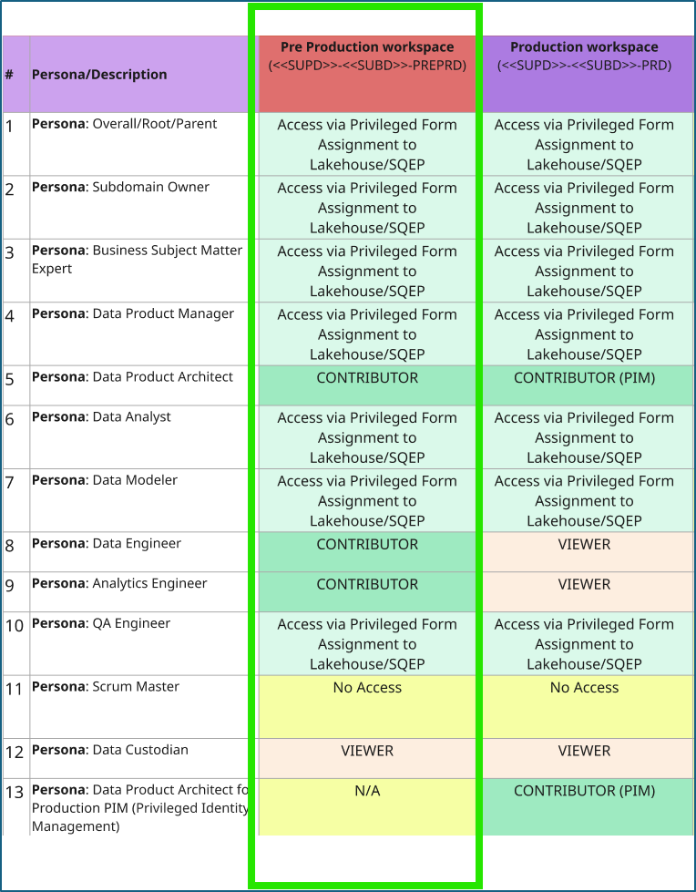
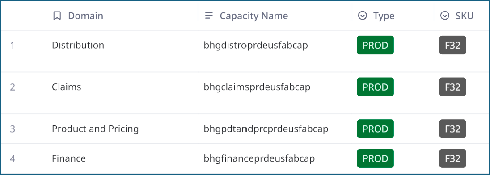

## Enablement Guide: PreProd Workspace

### Overview
This guide is designed for business domain users to understand and leverage **PreProd Fabric workspaces**.

### Context
Please refer to the ADR for this enablement guide. [ADR_PREPROD.docx](https://guardinsurancegroup.sharepoint.com/:w:/r/sites/DataAnalytics/DnA%20Artifact%20Library/ADR_PREPROD.docx?d=waf551b253c8f4d5e84c6d577c7b7c5e3&csf=1&web=1&e=1AF3oE)

### Understanding of the Workspace
PreProd workspace is another set of workspaces that each Super/Sub domain will receive as part of the Fluidity Platform offering/onboarding. It follows the same naming convention as other environment specific workspaces. The scope of this workspace is to perform business user acceptance test with production data. 

#### Persona Permission
The permission to this workspace is controlled via RBAC to the domain personas. Since the sensitivity of the data stored in this workspace is high, only certain domain persona security groups have the workspace level permission. All other domain personas are expected to access the data via Platform tickets such as  
- Data Sharing Form for Lakehouse/SQL EP  
- Onboarding Form for Report/Dashboard access via APP  

Following provides an overview of the persona-based access control. The Production workspace access is also highlighted to contrast some of the permissions for awareness purposes. The naming convention for the workspace is `<<SUPD>>-<<SUBD>>-PREPRD`.  

The Data/Analytics Engineers have been provided contributor access to this workspace as an explicit ask from Domain Delivery leadership. The business reason for the elevated permission is due to the “Speed and Scale” North Star aimed by the overall DnA strategy.

#### Capacity Assignment
This workspace shares the Production capacity of the Super domain. Following is a quick snapshot of the current Production capacity available for each Super domain.

### How to Story lanes?
#### Access the workspace in Fabric UI
To access this workspace in Fabric (DPM and Engineer persona), please refer to the following story lane [https://app.storylane.io/share/hqktvnvakzwg](https://app.storylane.io/share/hqktvnvakzwg)

#### Deploy the code to PreProd environment from ADO DevOps Pipelines
To deploy the code to PreProd environment through domain ADO DevOps CICD pipelines, please refer to the following story lane [https://app.storylane.io/share/awco8uvkre0h](https://app.storylane.io/share/awco8uvkre0h) 
