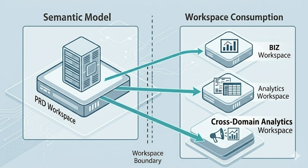
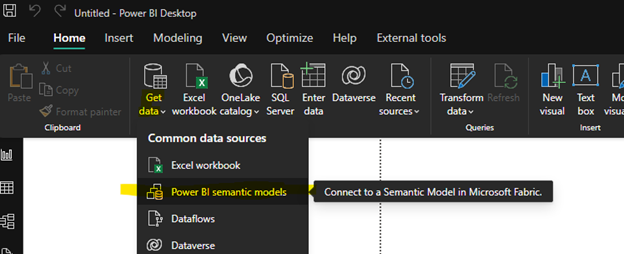
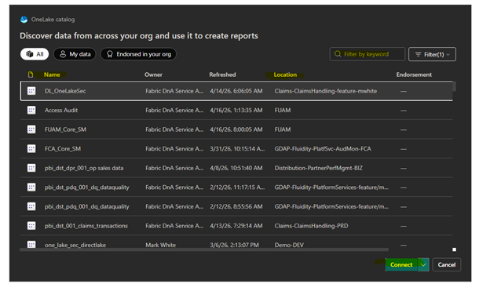
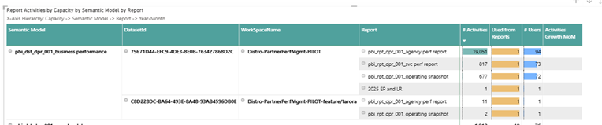

# Enablement Guide: Cross-Workspace Semantic Models in Microsoft Fabric

## Overview

Welcome to the enablement documentation for Microsoft Fabric and Power BI. This guide is designed for business domain users to understand and leverage **Cross-Workspace Semantic Models**.

Currently, data and reports reside together in the same workspace. While reports can be shared outside of the workspace using Power BI Apps, the semantic models are not enabled for cross workspace or cross domain collaboration. By using cross-workspace semantic models, we can separate our "data layer" (centralized semantic models) from our "presentation layer" reports). This ensures everyone in the organization builds upon a single source of truth, reducing data duplication and ensuring consistent business metrics.

---

## 1. Understanding Access Levels: Read vs. Build

When interacting with a semantic model located in a different workspace, you will require permissions based on your use case.

| Access Level | Description | When to Request |
| --- | --- | --- |
| **Read (for report consumers)** | Allows you to view reports and dashboards that are built on top of the semantic model. You cannot create new reports or query the underlying data directly. | Request this when you only need to consume existing reports and insights shared with you. |
| **Build (for report Producers)** | Allows you to create new Power BI reports or query the semantic model directly from your own workspace. | Request this when you need to build net-new reports, perform ad-hoc analysis in Excel, or connect a new Power BI Desktop file to the central model. |
| **Write** | *Restricted.* Allows modifying the structure, measures, and data of the semantic model itself. | **Do not request.** Write access is strictly reserved for *Contributors, Members, or Admins* in the source workspace of the domain. |

---

## 2. Requesting Access to a Semantic Model

If you need to consume reports or build reports from a semantic model that resides in a workspace which you have no access to, you may submit a formal data sharing request.

**Steps to Request Access:**

1. Submit the Data Sharing Request, including the DPM for approval.
2. Specify whether you need Build or Read permission, along with business justification.
3. Any specific security group that will need access or that may need to be created for this purpose.
4. DPM or Domain SME should review the request. If the semantic model contains PII or sensitive data, DPM / Domain SME will submit a request to the platform team to ensure the new user submitting the request for semantic model Read or Build will be added to the appropriate OneLake Security role as well (for Direct Lake semantic models). If it is an import semantic model, the semantic model owner (analytics engineer) should ensure the user is added to the correct RLS security role, if applicable, before sharing.

---

## 3. Connecting to an Existing Semantic Model

Once you have been granted **Build** access, you can connect to the semantic model to start building your own reports.

### Option A: From Power BI Desktop (Recommended for Report Builders)

1. Open **Power BI Desktop**.
2. Make sure you are signed in with your @\[guard.com](http://guard.com) account
3. On the Home ribbon, click **Get Data** > **Power BI semantic models**.
4. The OneLake Data Hub window will appear. Search for or select the semantic model you were granted access to, ensuring to check the “Location” column that tells you which workspace the model is in, as semantic models often carry the same name across different workspaces, such as UAT, QA, PRD.
5. Click **Connect**.

6. You are now connected via a "Live Connection." You will see the tables and measures appear in your Data pane on the right. You can now build report visuals, and when you publish this report, you can publish it to a workspace which you have Contributor to, such as Analytics or BIZ, leaving the original semantic model untouched.

### Option B: From the Power BI Service (Web)

1. Go to your target workspace where you want the report to live.
2. Click **+ New** > **Report**.
3. Select **Pick a published dataset**.
4. Choose the cross-workspace semantic model from the list and click **Auto-create** or **Blank report** to begin designing in your browser.
5. \[Storylane Demo that captures the above steps](https://app.storylane.io/share/h8at0gl8sugk)

---

## 4. Granting Permissions (For DPMs / Contributors)

If you are the owner of a central semantic model, you will need to grant access to domain users so they can consume or build upon your data.

### Method A: Granting Direct Permissions on the Semantic Model

1. In the Power BI Service, navigate to the workspace containing the semantic model.
2. Hover over the semantic model, click the **More options (...)** menu, and select **Manage permissions**.
3. Click **Add user**.
4. Enter the security groups of the users.
5. Check the boxes for the specific permissions you want to grant:
- *Allow recipients to build content with the data associated with this semantic model* (**Build**) or **Read.**
- *Uncheck “allow recipients to share the semantic model”*
6. Click **Grant**.
7. \[Storylane demo that captures the above steps](https://app.storylane.io/share/lebrnkcgtrwj)

### Method B: Granting Permissions via a Power BI App

A highly scalable way to distribute access without managing individual dataset permissions manually is through a Power BI Workspace App. Note that this must be done by the Admin/Platform team as the “Audience” tab is locked.

1. In your source workspace, click **Create App** (or **Update App**).
2. In the **Setup** and **Content** tabs, add the reports you wish to publish.
3. The **Audience** tab can only be updated by the Admins/Platform team.
4. Expand the **Advanced** section for the audience group.
5. Check the box: **Allow users to connect to the app's underlying datasets using the Build permission**.
6. Publish the app. Anyone granted access to that audience group will automatically receive Build access to the underlying semantic models to use in their own workspaces.

---

## 5. Tracking, Lineage, and Auditing

When semantic models are shared across multiple workspaces, understanding what reports depend on your central model is vital for change management.

### Viewing Lineage in the UI

1. Navigate to the workspace containing the central semantic model.
2. At the top right of the workspace view, toggle the view from **List** to **Lineage**.
3. You will see a visual map of the data flow.
4. Click on the icon representing the semantic model. The lineage view will expand to show all downstream reports, *including those residing in other workspaces*. This allows the Data Owner (DPM) to notify downstream users before making breaking changes to the model.

### Auditing with FUAM (Fabric User Activity Monitoring)

For enterprise-level tracking, organizations utilize Fabric User Activity Monitoring (FUAM) and the Microsoft Purview Hub.

- **FUAM Reports:** These customized administrative reports pull from the underlying Microsoft 365 Audit Logs. As a data owner or admin, you can use FUAM dashboards to track:
- Which workspaces and users are consuming from the semantic model
- Activity and report usage trends

- **Purview Hub (Future):** Fabric's built-in Purview Hub allows administrators to see cross-workspace data sharing metrics, track endorsement levels (Certified/Promoted), and view data sensitivity labels across the tenant.

---

## 6. Security Architecture: Import vs. Direct Lake

When exposing semantic models to a broader audience across different workspaces, security must be correctly configured so users only see the data they are authorized to see.

### Import Models and Row-Level Security (RLS)

- **How it works:** In Import mode, the data is highly compressed and cached directly inside the Power BI semantic model.
- **Security Application:** Security is handled exclusively by **Row-Level Security (RLS)** roles defined *within* the Power BI semantic model itself.
- **User Experience:** When a user with "Build" or "Read" access queries the model from their own workspace, the Power BI engine checks their identity against the RLS roles. If they are mapped to a role that filters the `DEPT` table to "Strategy & Analytics", their reports will only ever show data for that department, regardless of what workspace they build the report in. This pattern was tested and deployed for Finance to map Cost Centers to the aligned EMT member.

### Direct Lake Models and OneLake Security

- **How it works:** Direct Lake mode reads Delta Parquet files directly from OneLake without importing them into the Power BI engine, providing lightning-fast performance over massive data volumes.
- **Security Application:**
- **OneLake Data Access Roles:** Security can be pushed further down the stack. Instead of defining security in the semantic model, security can be defined at the data layer (the Lakehouse / data product level itself).

- **Best Practice for Enablement:** When using Direct Lake for cross-workspace models, the architectural preference is to rely on OneLake security roles where possible, ensuring that data security is uniformly enforced whether the user connects via Power BI, an external notebook, or an SQL endpoint. Fabric connections will be configured for each data product, in each environment using SSO.