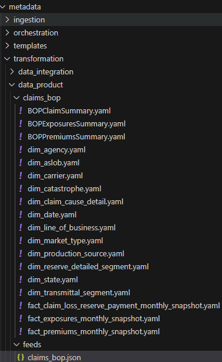

# Data Product Feed Config
The data product transformations processesing is configured using a JSON file in the sub-domain repo. The file is a representation of one or many transform files (transform_template) defined within a load group(s) array. The load groups used to define the sequence or dependencies of target tables to be processed. This file should be deployed to the Metadata Lakehouse during the CICD process. It also can be manually uploaded during the development.

## Format
```json
{
    "loadGroupA": [
        {
            "files": [
                {
                    "fileName": "ho_policy_data",
                    "modelConfigFolderName": "mgahop"
                }
            ]
        }
    ],
    "loadGroupB": [
        {
            "files": [
                {
                    "fileName": "dim_address",
                    "modelConfigFolderName": "mgahop"
                },
                {
                    "fileName": "dim_broker",
                    "modelConfigFolderName": "mgahop"
                },
                {
                    "fileName": "dim_city",
                    "modelConfigFolderName": "mgahop"
                }
            ]
        }
    ],
    "loadGroupC": [
        {
            "files": [
                {
                    "fileName": "fact_policy_coverage",
                    "modelConfigFolderName": "mgahop"
                },
                {
                    "fileName": "fact_policy",
                    "modelConfigFolderName": "mgahop"
                }
            ]
        }
    ]
}
```

## Sample Template
A sample template of a feed file can be found [here](/docs/templates/transform_feed_template.json).
## Repo Folder Structure

